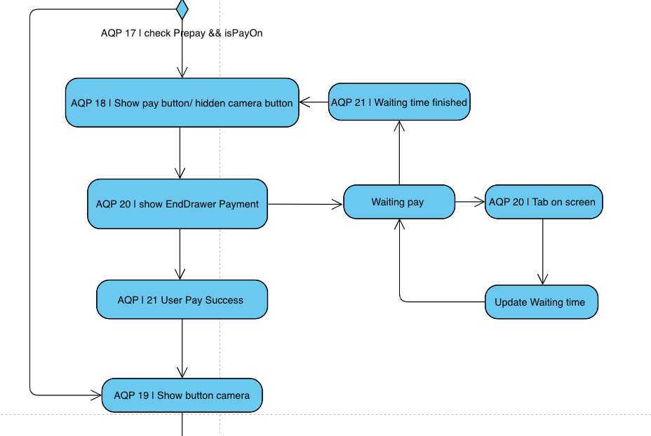

# **Activity Diagram dễ dàng truy xuất lỗi và nắm bắt luồng nhanh chóng trong Flutter**

Trong lĩnh vực phát triển phần mềm, việc duy trì và phát triển một dự án lớn đòi hỏi sự hợp tác chặt chẽ giữa các thành viên trong nhóm. Sự hiểu biết sâu sắc về cấu trúc và luồng hoạt động của ứng dụng là yếu tố then chốt để đảm bảo hiệu suất và chất lượng công việc. **Sơ đồ hoạt động (Activity Diagram)** đóng vai trò quan trọng trong việc này, giúp các lập trình viên mới và cả những người đã lâu không tương tác với dự án nhanh chóng nắm bắt và đóng góp hiệu quả.

## **1. Lợi Ích Của Sơ Đồ Hoạt Động**

### **1.1. Hỗ Trợ Thành Viên Mới Nhanh Chóng Tiếp Cận Dự Án**

- **Hiểu Tổng Quan Hệ Thống:**
    - Sơ đồ hoạt động cung cấp cái nhìn toàn cảnh về luồng công việc và logic của ứng dụng.
    - Giúp giảm thời gian đào tạo và hướng dẫn ban đầu.

- **Giảm Khả Năng Hiểu Sai:**
    - Tránh hiểu nhầm về chức năng hoặc luồng dữ liệu do sự phức tạp của code.
    - Cung cấp một ngôn ngữ chung giữa các thành viên.

### **2.2. Hỗ Trợ Lập Trình Viên Khi Quay Lại Tính Năng Sau Thời Gian Dài**

- **Nắm bắt Lại luồng Nhanh Chóng:**
    - Sau một thời gian không làm việc với một tính năng cụ thể, ngay cả lập trình viên viết ra nó cũng có thể gặp khó khăn.
    - Sơ đồ hoạt động giúp họ nhanh chóng nhớ lại cách thức hoạt động và logic liên quan. 

- **Tiết Kiệm Thời Gian:**
    - Giảm thiểu thời gian đọc lại code và tài liệu cũ.
    - Tập trung vào việc giải quyết vấn đề hiện tại hoặc cải tiến tính năng.

### **2.3. Dễ Dàng Nắm Bắt Code và Tìm Kiếm Bug**

- **Xác Định Điểm Nút và Điểm Nghẽn:**
    - Sơ đồ hoạt động cho thấy rõ các điểm chuyển đổi trong hệ thống, giúp xác định vị trí có thể xảy ra lỗi.
    - Hỗ trợ phân tích luồng dữ liệu và trạng thái hệ thống.

- **Hợp Tác Trong Việc Sửa Lỗi:**
    - Dễ dàng trao đổi và thảo luận về vấn đề với các thành viên khác dựa trên một biểu đồ chung vì có thể mỗi thành viên lại đảm nhận 1 luồng khác nhau của dự án.
    - Tăng hiệu quả làm việc nhóm trong việc debug và tối ưu hóa.

### **2.4. Hỗ Trợ Trong Việc Thiết Kế và Mở Rộng Tính Năng**

- **Lập Kế Hoạch Hiệu Quả:**
    - Trước khi triển khai tính năng mới, sơ đồ hoạt động giúp hình dung cách tính năng đó sẽ tích hợp vào hệ thống hiện có.
    - Dự đoán được các tác động và rủi ro tiềm ẩn. Có lẽ đây là tính năng hữu ích nhất mà tôi cảm thấy khi sử dụng Activity Diagram. Các luồng/tính nắng mới có độ phức tạp cao, tôi đã vẽ nó ra trước và đã giảm thiểu được rất nhiều thời gian code và các lỗi tiềm ẩn có thể sảy ra. 

## **3. Cách Xây Dựng Sơ Đồ Hoạt Động Hiệu Quả**

### **3.1. Sử Dụng Công Cụ Phù Hợp**

- **Công Cụ Trực Quan:**
    - Sử dụng các phần mềm như Lucidchart, Draw.io, hoặc Microsoft Visio để vẽ sơ đồ.
    - Đảm bảo sơ đồ rõ ràng, dễ đọc và dễ chia sẻ.
    - Công cụ phổ biến và tôi thường sử dụng là Visual Paradigm https://online.visual-paradigm.com/
    - Đảm bảo sơ đồ luôn phản ánh đúng trạng thái hiện tại của hệ thống.
    - Cập nhật khi có thay đổi về luồng công việc hoặc thêm bớt tính năng.

  
### **3.2. Cách truy suất luồng trong code**

Trước tiên, bạn hay vẽ sơ đồ và hãy đảm bảo chắc chắn rằng luồng code của bạn là hoàn toàn chặt chẽ. Tất nhiên có thể nó sẽ thay đổi trong lúc bạn code nếu như luồng đó trong thực tế không hợp lý. 

- **Từ biểu đồ đến code**
    - Ngoài việc sử dụng debug để kiểm tra xe ứng dụng có đang chạy đúng như mô tả hay không, chúng ta có thể để lại log tạo thành 1 list log để quan sát luồng chạy của nó, sau đó có thể lưu nó cào 1 file txt để đảm bảo có thể xem lại vào kiểm tra tại sao ứng dụng lại bị lỗi.
    
    - Tôi sẽ ký hiệu tên 1 hành động là nội dung của 1 log, sau đó in nó ra màn hình. 
    - VD: "AQP 20 | show EndDrawer Payment". Tôi sẽ ký hiệu AQP là mã chức năng riêng, 20 là bước, sau đấy là mô tả bược hiện tại đang làm gì. 

- **Cách tạo log dễ quan sát**
    
    - Log mặc định của Flutter sẽ khá là đơn điều, tôi đã có 1 bài viết về cách tạo màu cho log, hãy tham khảo bài viết của tôi tại https://wong-coupon.gitbook.io/flutter/easy-code/log-color
    - Các bước thực hiện trong biểu đồ sẽ dễ dàng được tìm thấy trong log, và dễ dàng tìm ra các lỗi nằm ở đâu khi úng dụng sảy ra vấn đề. Nó sẽ rất hữu ích nếu như file log được lưu vào bộ nhớ. 
    
  
## **4. Kết Luận**

Cách này đã giúp tôi và đội ngũ phát triển tiết kiệm vô cùng nhiều thời gian trong việc tìm ra lỗi khi không có công cụ debug hay tìm lỗi trên app đã release. Sơ đồ hoạt động là công cụ mạnh mẽ giúp cải thiện hiệu suất và chất lượng trong phát triển phần mềm. Bằng cách cung cấp cái nhìn trực quan về hệ thống, nó không chỉ hỗ trợ các lập trình viên mới nhanh chóng hòa nhập mà còn giúp tất cả mọi người trong nhóm làm việc hiệu quả hơn.

