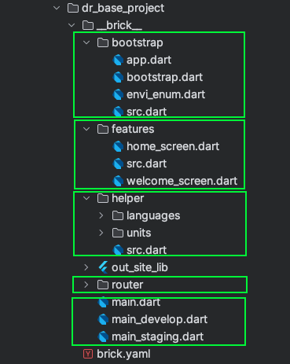
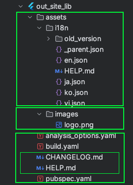

1. Tại sao cần 1 base project
Bất kỳ lập trình viên Flutter nào sau khi đã trải qua 1 vài dự án luôn muốn tạo riêng cho mình 1 mẫu project để khởi tạo cho nhiều dự án khác nhau. 
Nhưng sẽ có nhiều vấn đề gặp phải cho chúng ta phải bóc tách nhưng phần có thể dùng lại ở dự án mới và sẽ tốn 1 khoảng thời gian dài tạo foulder và các file code, việc này rất tốn công sức.

Vì những nguyên nhân như trên tôi đã tìm ra nhiều cách để tạo những file đó, có thể bằng câu lệnh tạo file của windown, nhưng có 1 công cụ vô cùng mạnh khác sẽ giúp ích cho chúng ta và đồng nghiệp đó là mason. 
Nếu bạn chưa biết gì về công cụ này, hãy tham khảo bài viết của tôi tại https://wongcoupon.com/en/doc/help/flutter/boost-your-flutter-development-efficiency-with-mason

2. Các thư viện cần có của các dự án 
Trong bài viết này tôi sẽ giúp bạn có cái nhìn về cách tôi triển khai 1 dự án lớn cần nhiều các cài đặt để đảm bảo code được clean và dễ dàng mở rộng, và bảo trì sau này. 
2.1   Thư viện truy xuất dữ liệu get_it: https://pub.dev/packages/get_it 
Đây là 1 thư viện nổi tiếng cho phép việc truy cập vào các repository 1 cách đơn giản và ở bất kỳ đâu trong project  

2.2   Thư viện quản lý router của úng dụng go_router https://pub.dev/packages/go_router
Đây là 1 thư viện do chính flutter phát triển để quản lý các router trong ứng dụng, nó giúp sử dụng khá hiệu quả trên cả ứng dụng di động và trên nền tảng web. 

2.3   Thư viện state management flutter_bloc https://pub.dev/packages/flutter_bloc
Bloc là 1 thư viện quản lý trạng thái được đánh giá là 1 trong những thư viện quản lý trạng thái tốt nhất cho Flutter. Bạn có thể tham khảo bài viết về bloc của tội tại //TODO link bloc.

2.4   Thư viện sinh code tự động json_serializable https://pub.dev/packages/json_serializable freezed https://pub.dev/packages/freezed
một trong những việc code trở nên hiệu quả là tự động hoá tạo những đoạn code lặp đi lặp lại, sử dụng thư viện json_serializable, và freezed sẽ hộ trợ tạo các hàm dùng phổ biến cho object 

2.5   Thư viện giúp code trở nên sạch và ngắn gọn lint https://pub.dev/packages/lint 
lint là 1 thư viện cho phép bạn giúp code của mình và các thành viên trong nhóm trở nên tường minh hơn và rõ ràng hơn. Giúp những lập trình viên chưa đọc Effective Dart https://dart.dev/effective-dart cũng có thể code trở nên sạch sẽ và hiệu quả hơn với dart.  

2.6   Thư viện tạo icon cho các nền tảng flutter_launcher_icons
Đây là thư viện gần như mọi ứng dụng đa nền tảng nên có, vì nó giúp giảm thời gian setup icon cho ứng dụng. 
 
3. sử dụng mason để triển khai base project cụ thể 

Tôi sẽ hướng dẫn cách tôi triển mai mason cho các dự án của riêng mình, từ đó bạn có thể tham khảo và tự xây dựng cho bản thân mình 1 mẫu base project cho riêng bạn 



Tôi chia folder lib của thôi thành 5 phần. 
Phần 1 là hàm main để khởi chạy app, được chia làm 3 hàm main tương ứng với 3 môi trường khác nhau của ứng dụng,  
Phần 2 là folder router, quản lý router trong ứng dụng sử dụng go_router https://pub.dev/packages/go_router được đề cập ở trên.  
Phần 3 là folder helper, nơi chứa 2 thành phần chính là ngôn ngữ và các hàm sẽ sử dụng lại nhiều lần trong project 
Phần 4 là folder features, nơi chứa các tính năng chính của ứng dụng được tách riêng ra giúp dễ dàng quản lý, Vd quản lý tài khoản ngừoi dùng, setting, ... 
Bạn có thể tham khảo áp dụng kiến trúc clean architecture cho từng tính năng riêng biệt một. Bạn có thể tham khảo bài viết của tôi tại https://wongcoupon.com/vi/doc/help/flutter/maintain-and-extend-code-easier-with-clean-architecture


Phần thiết lập các config của project sẽ như sau

Phần 1 là folder assets chứa 2 thành phần chính là file thay đổi ngôn ngữ và các hình ảnh sử dụng trong ứng dụng.
Phần 2 là các config cho ứng dụng. Gồm lint code: analysis_options.yaml, hàm config cho việc sinh code build.ymal, và cuối cùng là pubspec.yaml 
Phần 3 là các file viết chú thích gồm HELP.md và CHANGELOG.md ghi ghép lại các thay đổi trong các version app. 

Để tham khảo chi tiết các phần code của tôi, hãy tham khảo dr_base_project https://brickhub.dev/bricks/dr_base_project dành cho mason

4. Thiết lập các môi trường dev giúp cải thiện thời gian code. 

Việc lập trình đòi hỏi sự cẩn thận, chúng ta không thể test các tính năng mới trên server thật, nhưng việc sửa đổi tên miền sẽ tốn tất nhiều thời gian, tôi sẽ giới thiệu cho bạn các tôi đang sử dụng để tạo ra môi trường cho việc lập trình. 

4.1. Enum chứa cá thông tin môi trường 

```dart
/*
SET UP
void main() {
  ourEnvi = EnviEnum.develop;
  ...
}

USE
ourEnvi = EnviEnum.develop;
 */
late EnviEnum ourEnvi;

enum EnviEnum {
  develop(
      code: 0,
      title: "develop",
      config: _BaseUrlConfig(
          baseUrl: "http://192.168.20.82:5173/",
      ),),
  staging(
      code: 1,
      title: "staging",
      config: _BaseUrlConfig(
          baseUrl: "https://staging-partner.kdmp.net/",
      ),),
  product(
      code: 2,
      title: "product",
      config: _BaseUrlConfig(
          baseUrl: "https://partners.kdmp.net/",
      ),);

  const EnviEnum({ required this.code, required this.title, required this.config});

  final int code;
  final String title;
  final _BaseUrlConfig config;

  bool get inDevelopment => this == EnviEnum.develop;
  bool get inStaging => this == EnviEnum.staging;
  bool get inProduction => this == EnviEnum.product;

  String get baseUrl => switch(this) {
    EnviEnum.develop => EnviEnum.develop.config.baseUrl,
    EnviEnum.staging => EnviEnum.staging.config.baseUrl,
    EnviEnum.product => EnviEnum.product.config.baseUrl,
  };

}

class _BaseUrlConfig {
  final String baseUrl;
  const _BaseUrlConfig({
    required this.baseUrl,});
}

extension EnviEnumHelper on EnviEnum {

}
```

bạn có thể thêm bất kỳ tên miền hay config nào khác vào class _BaseUrlConfig để tuỳ chỉnh cho dự án của mình. 
Sau đó chúng ta sẽ triển khai 3 hàm main theo từng môi trường. 

Môi trường develop, môi trường này phục vụ cho việc lập trình với server local 

```dart
void main() {
  ourEnvi = EnviEnum.develop;
  enviIsDevelop = true;
  myMain(() {
    setup();
    runApp(const App());
  });
}
```


Môi trường staging, môi trường này phục vụ cho việc lập trình với server thực nhưng trong nội bộ, có thể cho tester test trước khi xuất bản chính thức 

```dart
void main() {
  ourEnvi = EnviEnum.staging;
  enviIsDevelop = true;
  myMain(() {
    setup();
    runApp(const App());
  });
}
```

Môi trường product, môi trường này là môi trường cuối cùng dành cho người dùng. Phải đảm bảo môi trường này không còn lỗi nào phát sinh. 

```dart
void main() {
  ourEnvi = EnviEnum.product;
  enviIsDevelop = false;
  myMain(() {
    setup();
    runApp(const App());
  });
}
```
Trên đây là cách tôi thiết lập 1 base project cho flutter, bạn có thể tham khảo và tự xây dựng 1 cái cho bản thân và đội nhóm của mình giúp giảm thời gian thiết lập các project mới. 
