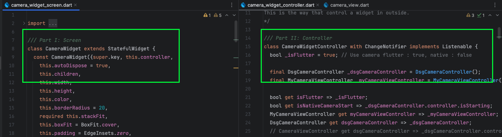
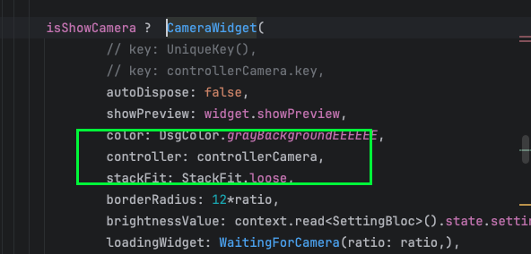
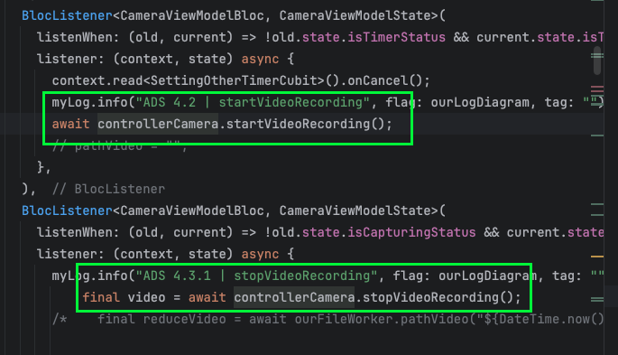

Điều khiến widget bằng controller với change notifier

1. Khi muốn điều khiển widget từ bên ngoài 
Việc sử dụng state management vô cùng tiện lợi, nhưng đôi lúc chúng ta cần những thứ thuần flutter không liên quan đến các thư viện bên thứ 3. 
Trong 1 số tường hợp, chúng ta có những widget cần sử dụng chung nhưng lại cần phải có 1 công cụ quản lý trạng thái thuần tuý của flutter, 
khi đó change notifier là 1 công cụ hữu hiệu, chúng ta có thể thấy những controller cơ bản và quen thuộc vẫn hay sử dụng như Text field controller https://api.flutter.dev/flutter/widgets/TextEditingController-class.html, scroll controller https://api.flutter.dev/flutter/widgets/ScrollController-class.html.
change notifier là 1 cách tạo các widget tương tự như thế, 
2. Triển khai change notifier nhanh chóng.
   change notifier yêu cầu cần phải khởi taọ và viết khá nhiều đoạn code. tôi đã sử dụng mason để hỗ trợ tạo ra 1 form code mẫu dễ dàng cho việc code.  
Nếu bạn chưa biết gì về mason hãy tham bảo bài viết https://wongcoupon.com/en/doc/help/flutter/boost-your-flutter-development-efficiency-with-mason
Bạn có thể tham khảo mason của tôi tạo tại https://brickhub.dev/bricks/dr_change_notifier
2.1. Phần controller
```dart
/// Part II: Controller
class {{name.pascalCase()}}Controller with ChangeNotifier implements Listenable {
  /// Learn more: url_to_document_of_package

  int _example = 0;
  int get example => _example;

  // USE | controller.example = example;
  set example(int index){
    _example = index;
    notifyListeners();
  }

  //  @override
  //   void dispose() {
  //   super.dispose();
  //
  // }
}
```
Phần này chứa các biến lưu trữ dữ liệu, nếu bạn muốn cập nhập màn hình có chứa controller đó hãy gọi hàm notifyListeners(); sau khi kết thúc function, nó sẽ rebuild lại giao diện. 

2.2. Phần UI 

```dart
/// Part I: Screen
class {{name.pascalCase()}} extends StatefulWidget {
  const {{name.pascalCase()}}({super.key, this.controller, this.autoDispose = true});

  final  {{name.pascalCase()}}Controller? controller;
  final bool autoDispose;

  @override
  State<{{name.pascalCase()}}> createState() => _{{name.pascalCase()}}State();
}

class _{{name.pascalCase()}}State extends State<{{name.pascalCase()}}> {

  late {{name.pascalCase()}}Controller controller;

  @override
  void initState() {
    super.initState();
    controller = widget.controller ?? {{name.pascalCase()}}Controller();
    controller.addListener(() {
      if (mounted) {
        setState(() {});
      }
    });
  }

  // update once properties is changed
  @override
  void didUpdateWidget({{name.pascalCase()}} oldWidget) {
    super.didUpdateWidget(oldWidget);
    // if (widget.path != oldWidget.path) {
    //
    // }
  }

  @override
    void dispose() {
    if(widget.autoDispose) controller.dispose();
    super.dispose();
  }

  @override
  Widget build(BuildContext context) {

    // final ratio = context.dsgRatio;

    return const Text("ok");
  }
}

```
Trong phần UI này tôi đã thiết lập sẵn việc tự khởi tạo controller nếu không truyền controller vào trong hàm initState(), 
Tự động dispose khi widget bị huỷ trong dispose()

Phần này sẽ lắng nghe khi controller gọi hàm notifyListeners() sau đó cập nhập lại giao diện 
```dart
    controller.addListener(() {
      if (mounted) {
        setState(() {});
      }
    });
```

3. Sử dụng trong thực tế 



Giả sử tôi có 1 cấu trúc code Change notifier cho camera như trong hình ảnh.  
Việc khởi tạo sẽ diễn ra như sau.  

Bược 1 khởi tạo controller ở bất kỳ đâu mà bạn mong muốn 
```dart
CameraWidgetController controllerCamera = CameraWidgetController();
```
hãy đảm bảo bạn dispose nó nếu không còn cần sử dụng nó.  

Bước 2 khởi tạo giao diện 


Hãy đưa controller vào trong widget cần được điều khiển từ bên ngoài. 

Bước 3 sử dụng 



Giờ bạn có thể sử dụng nó ở bất kỳ đâu trong project mà bạn mong muốn. 

Trên đây là bài chia sẻ của tôi về cách mà tôi đang làm để điều khiển các widget từ bên ngoài. Bạn có thể tham khảo vào tạo cho bản thân mình 1 mẫu code riêng bằng mason tuỳ theo sở thích và phong cách code của bạn. 


