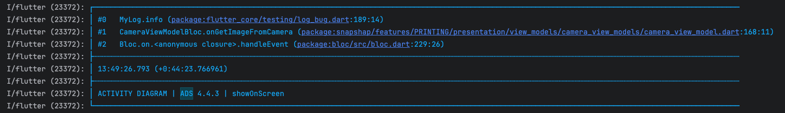

## Thiết Lập Log Có Màu Sắc Và Lưu Log Vào Bộ Nhớ Thiết Bị

### Bước 1: Thêm Phụ Thuộc
Trước tiên, hãy đảm bảo bạn có các phụ thuộc cần thiết trong tệp `pubspec.yaml`. Thêm các phụ thuộc sau:

```yaml
dependencies:
  flutter:
    sdk: flutter
  logger: ^2.3.0
```

### Bước 2: Tạo Lớp Logging
Sử dụng đoạn mã đã cung cấp để tạo một lớp logging. Lớp này sẽ xử lý log có màu sắc và lưu log vào bộ nhớ thiết bị.

```dart
import 'dart:async';
import 'dart:convert';
import 'dart:developer' as developer;
import 'dart:io';

import 'package:flutter/foundation.dart';
import 'package:logger/logger.dart';

bool enviIsDevelop = true;

class MyLog {
  bool isLogging = true;

  Logger logger = Logger(
    filter: kReleaseMode ? PermissiveFilter() : DevelopmentFilter(),
    printer: PrettyPrinter(
      methodCount: 3,
      printEmojis: false,
      printTime: true, // Log sẽ chứa thời gian
    ),
  );

  Future<void> setUp({
    String? path,
    bool printTime = true,
    bool isLogging = true,
    String? noteInfoFileLog,
  }) async {
    if (this.isLogging != isLogging) this.isLogging = isLogging;
    if (path != null) {
      final file = File(path);
      if (noteInfoFileLog != null) {
        await file.writeAsString(
          noteInfoFileLog,
          mode: FileMode.writeOnlyAppend,
        );
      }

      final FileOutput2 fileOutPut = FileOutput2(
        file: file,
      );
      final ConsoleOutput consoleOutput = ConsoleOutput();
      final List<LogOutput> multiOutput = [fileOutPut, consoleOutput];
      logger = Logger(
        printer: PrettyPrinter(
          methodCount: 3,
          errorMethodCount: 12,
          lineLength: 150,
          printEmojis: false,
          printTime: printTime,
        ),
        filter: kReleaseMode ? PermissiveFilter() : DevelopmentFilter(),
        output: MultiOutput(multiOutput),
      );
    } else {
      logger = Logger(
        printer: PrettyPrinter(
          methodCount: 3,
          errorMethodCount: 12,
          lineLength: 150,
          printEmojis: false,
          printTime: printTime,
        ),
        filter: kReleaseMode ? PermissiveFilter() : DevelopmentFilter(),
      );
    }
  }

  void trace(Object? object, {String? tag, String? flag, Object? error}) {
    if (kDebugMode || isLogging) {
      logger.t(
        _print(
          object,
          tag: tag ?? _getParentMethodName(),
          flag: flag,
        ),
        time: DateTime.now(),
        error: error,
      );
    }
  }

  void debug(Object? object, {String? tag, String? flag, Object? error}) {
    if (kDebugMode || isLogging) {
      logger.d(
        _print(
          object,
          tag: tag ?? _getParentMethodName(),
          flag: flag,
        ),
        time: DateTime.now(),
        error: error,
      );
    }
  }

  void info(Object? object, {String? tag, String? flag, Object? error}) {
    if (kDebugMode || isLogging) {
      logger.i(
        _print(
          object,
          tag: tag ?? _getParentMethodName(),
          flag: flag,
        ),
        time: DateTime.now(),
        error: error,
      );
    }
  }

  void warning(Object? object, {String? tag, String? flag, Object? error}) {
    if (kDebugMode || isLogging) {
      logger.w(
        _print(
          object,
          tag: tag ?? _getParentMethodName(),
          flag: flag,
        ),
        time: DateTime.now(),
        error: error,
      );
    }
  }

  void error(Object? object, {String? tag, String? flag}) {
    if (kDebugMode || isLogging) {
      logger.e(
        _print(
          object,
          tag: tag ?? _getParentMethodName(),
          flag: flag,
        ),
        time: DateTime.now(),
        error: object,
      );
    }
  }

  void fatal(Object? object, {String? tag, String? flag, required Object error, StackTrace? stackTrace}) {
    if (kDebugMode || isLogging) {
      logger.f(
        _print(
          object,
          tag: tag ?? _getParentMethodName(),
          flag: flag,
        ),
        time: DateTime.now(),
        error: error,
        stackTrace: stackTrace,
      );
    }
  }
}

String? _getParentMethodName() {
  try {
    throw Exception();
  } catch (e, stackTrace) {
    final frames = stackTrace.toString().split('\n');

    var father = "";
    var grandfather = "";

    try {
      final fatherFrame = frames[3];
      father = fatherFrame.split(' ').last;
    } catch (_) {}
    try {
      final grandfatherFrame = frames[4];
      grandfather = grandfatherFrame.split(' ').last;
    } catch (_) {}

    return father == "" && grandfather == "" ? null : "$father${grandfather == "" ? grandfather : "\n$grandfather"}\n";
  }
}

String _print(Object? object, {String? tag, String? flag}) =>
    (tag == null || tag == "") && (flag == null || flag == "")
        ? object.toString()
        : tag != null && tag != "" && flag != null && flag != ""
            ? "$tag | ${flag.toUpperCase()} | $object"
            : (tag == null || tag == "") && flag != null && flag != ""
                ? "${flag.toUpperCase()} | $object"
                : "$tag | $object";

class FileOutput2 extends LogOutput {
  final File file;
  final bool overrideExisting;
  final Encoding encoding;
  late IOSink _sink;

  FileOutput2({
    required this.file,
    this.overrideExisting = false,
    this.encoding = utf8,
  });

  @override
  Future<void> init() async {
    _sink = file.openWrite(
      mode: overrideExisting ? FileMode.writeOnly : FileMode.writeOnlyAppend,
      encoding: encoding,
    );
  }

  @override
  void output(OutputEvent event) {
    try {
      if (event.origin.level != Level.trace) _sink.writeAll(["${event.origin.level.name} | ${event.origin.time} | ${event.origin.error} \n${event.origin.message} \n\n"], '\n');
    } catch (e) {
      print(e);
    }
  }

  @override
  Future<void> destroy() async {
    await _sink.flush();
    await _sink.close();
  }
}

void myDebugger(Object? object, {String? tag, String? flag, bool when = true}) {
  developer.debugger(
    when: when,
    message: _print(
      object,
      tag: tag ?? _getParentMethodName(),
      flag: flag,
    ),
  );
}
```
Chú thích: 


```dart
String? _getParentMethodName() {
  try {
    throw Exception();
  } catch (e, stackTrace) {
    final frames = stackTrace.toString().split('\n');

    var father = "";
    var grandfather = "";

    try {
      final fatherFrame = frames[3];
      father = fatherFrame.split(' ').last;
    } catch (_) {}
    try {
      final grandfatherFrame = frames[4];
      grandfather = grandfatherFrame.split(' ').last;
    } catch (_) {}

    return father == "" && grandfather == "" ? null : "$father${grandfather == "" ? grandfather : "\n$grandfather"}\n";
  }
}
```
Hàm _getParentMethodName() thực hiện lấy vị trí của đoạn log hiển thị trong project giống như khi ta thấy trong các log lỗi, điều này giúp thuận tiện cho việt trỏ thẳng đến vị trí ghi log trong code giảm thiết thời gian tìm kiếm.


```dart
String _print(Object? object, {String? tag, String? flag}) =>
    (tag == null || tag == "") && (flag == null || flag == "")
        ? object.toString()
        : tag != null && tag != "" && flag != null && flag != ""
            ? "$tag | ${flag.toUpperCase()} | $object"
            : (tag == null || tag == "") && flag != null && flag != ""
                ? "${flag.toUpperCase()} | $object"
                : "$tag | $object";
```
Bạn có thể tuỳ chỉnh việc hiển thị log ra màn hình với hàm _print, tôi thêm tag và flag để dễ dàng phân loại hơn cho Log. Hãy tuỳ chỉnh nó theo mong muốn của bạn
VD: "ACTIVITY DIAGRAM | ADS 4.4.6.0 | get image screenshot" flag của tôi là ACTIVITY DIAGRAM cho biết đây là log được lấy tù biểu đồ diagram. tag: ADS 4.4.6.0 cho biết tôi đang ở bước 4.4.6.0 của biểu đồ. 
Của tôi nếu tag và flag không được điền, nó sẽ tự động lấy địa chỉ hàm cha của nó.

### Step 3: Initialize Logging in Your App
Initialize the logging system in your main application file. Make sure to call the `setUp` method with the desired parameters.

```dart
const ourLogDiagram = "Activity Diagram";

void main() async {
  WidgetsFlutterBinding.ensureInitialized();
  MyLog myLog = MyLog();
  await myLog.setUp(
    path: 'path/to/your/logfile.txt', // Cung cấp đường dẫn nơi bạn muốn lưu tệp log
    printTime: true,
    isLogging: true,
    noteInfoFileLog: 'This is the log file for my Flutter app.',
  );

  // Ví dụ sử dụng logging
  myLog.info('App started');
  myLog.debug('Debugging info');
  myLog.error('An error occurred');
  myLog.info("ADS 4.4.7 | save image", flag: ourLogDiagram, tag: "Write log");


  runApp(MyApp());
}
```

### Bước 4: Sử Dụng Các Phương Thức Logging
Sử dụng các phương thức logging được cung cấp trong lớp `MyLog` xuyên suốt ứng dụng của bạn để ghi lại các thông báo ở các mức độ khác nhau (trace, debug, info, warning, error, fatal).

```dart
class MyApp extends StatelessWidget {
  @override
  Widget build(BuildContext context) {
    MyLog myLog = MyLog();
    
    myLog.info('Building MyApp');
    
    return MaterialApp(
      home: Scaffold(
        appBar: AppBar(
          title: Text('Flutter Logging Example'),
        ),
        body: Center(
          child: ElevatedButton(
            onPressed: () {
              myLog.debug('Button pressed');
              myLog.warning('This is a warning');
              myLog.error('This is an error');
            },
            child: Text('Press Me'),
          ),
        ),
      ),
    );
  }
}
```

Kiểm Tra Log Trong Thiết Bị

Sau khi chạy ứng dụng và tạo log, bạn có thể tìm thấy file log trong đường dẫn đã chỉ định (ví dụ path/to/your/logfile.txt). Mở file này lên và bạn sẽ thấy các log đã được lưu lại.
