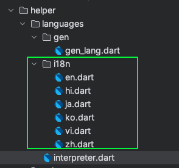

Chuyển đổi ngôn ngữ cho app flutter không sử dụng bên thứ 3

Chuyển đổi ngôn ngữ là điều quan trọng và cần thiết để ứng dụng của bạn tiếp cận toàn cầu. 

1. Chuyển đổi ngôn ngữ với file json 

Ưu điểm của cách này là có thể lưu trữ và tất cả các file ngôn ngữ sẽ được lưu dứoi dạng json, có thể tải những file json này từ server để đọc trên ứng dụng giúp giảm thời gian tải ứng dụng từ chợ úng dụng. 
Cách này thường được sử dụng với mobile app. Cách này không được sử dụng trong trang web này, tôi sẽ giới thiệu cách chuyển đổi ngôn ngữ trên web flutter vào phần sau. 

- Tạo mẫu json 

Hãy xem cách tôi thiết lập các file json trong hình. tôi có 4 ngôn ngữ là tiếng anh, tiếng nhật, tiếng hàn và tiếng việt,

Đây là nội dung bên trong file en.json
```json
{
  "welcomeBack": "Welcome Back",
  "welcomeBackNameApp": "Welcome @nameUser Back @nameApp"
}
```
Đây là nội dung bên trong file vi.json
```json
{
  "welcomeBack": "Chào mừng trở lại",
  "welcomeBackNameApp": "Chào mừng @nameUser trở lại @nameApp"
}
```
Hãy tương tựu lại với các file json của ngôn ngữ khác.
Bạn có thể thấy, chúng ta sẽ sử dụng key của các phần tử trong json để xác định ngôn ngữ này. 

Trước khi vào các phần chi tiết, tôi sẽ trình bày ý tưởng của tôi: 
Tôi sẽ đọc nội dụng trong file json, sau đó sử dụng thư viện shared_preferences https://pub.dev/packages/shared_preferences để lưu nội dụng đọc ra vào bộ nhớ thiết bị. 
Khi sử dụng chỉ việc lấy từ trong bộ nhớ ra để sử dụng, khi chuyển ngô ngữ thì sẽ lặp lại thao tác đó từ đầu. 

Trước tiên chúng ta sẽ custom lại thư viện shared_preferences 1 chút, đây là cách tôi tách biệt các thư viện ra khỏi project chính của tôi, việc này có ưu điểm là nó sẽ dễ dàng thay đổi các thư viện khác nếu trong tương lại nó ngừng hỗ trợ và giảm tối đa sự phúc tạo của thư viện khi đưa vào trong project, tôi đã tình bày trong bài viết package của tôi *LINK*
Tôi sẽ lược bớt các hàm không cần thiết và để lại các hàm chính là setup , read, write 

```dart
import 'dart:convert' as convert;

import 'package:flutter/cupertino.dart';
import 'package:shared_preferences/shared_preferences.dart';


class MyPrefs {
/*
    Learn more: https://pub.dev/packages/shared_preferences
    How to use?
        Step 1: Define
          MyPrefs myPrefs = MyPrefs();
        Step 2: Setup on init
          myPrefs.setUp();
        Step 3: E.g use
          myPrefs.write(constSaveLocale, locale.toString());
*/

  SharedPreferences? prefs;

  Future<void> setUp() async {
    prefs = await SharedPreferences.getInstance();
  }

  Future<bool> write(String key, dynamic value) async {
    final SharedPreferences prefs = this.prefs ??= await SharedPreferences.getInstance();
    if (value.runtimeType == String) {
      return tryBool(prefs.setString(key, value as String));
    } else if (value.runtimeType == int) {
      return tryBool(prefs.setInt(key, value as int));
    } else if (value.runtimeType == bool) {
      return tryBool(prefs.setBool(key, value as bool));
    } else if (value.runtimeType == double) {
      return tryBool(prefs.setDouble(key, value as double));
    } else if (value.runtimeType == List<String>) {
      return tryBool(prefs.setStringList(key, value as List<String>));
    } else if (value.runtimeType.toString() == "_Map<String, dynamic>") {
      return tryBool(prefs.setString(key, convert.jsonEncode(value as Map<String, dynamic>)));
    } else if (value.runtimeType == DateTime) {
      return tryBool(prefs.setString(key, value.toString()));
    } else {
      return Future(() => false);
    }
  }
  

  /// Đảm bảo rằng đã chạy setUp()
  Future<T?> read<T>(String key) async {
    try {
      final SharedPreferences prefs = this.prefs!;
      if (T == String) {
        return prefs.getString(key) as T;
      } else if (T == int) {
        return prefs.getInt(key) as T;
      } else if (T == bool) {
        return prefs.getBool(key) as T;
      } else if (T == double) {
        return prefs.getDouble(key) as T;
      } else if (T == List<String>) {
        return prefs.getStringList(key) as T;
      } else if (T == Map<String, dynamic>) {
        return prefs.getString(key) == null ? null : convert.jsonDecode(prefs.getString(key)!) as T;
      } else if (T == DateTime) {
        return prefs.getString(key) == null ? null : DateTime.parse(prefs.getString(key)!) as T;
      } else {
        return null;
      }
    } catch (error) {
      print(error, tag: "MyPrefs.read<$T> (input: $key)");
      return null;
    }
  }

}
```

Sau khi đã thiết lập xong các hàm để lưu ngôn ngữ hiện có vào bộ nhớ máy,  ta chuyển qua bước setup đọc vào lấy ngôn ngữ hiện có từ file json, 
Gỉa định rằng tất cả các file ngôn ngữ json của bạn được lưu trong thư mục "assets/i18n/", và bạn đã khai báo nó trong pubspec.yaml

```dart
const String constSaveLocale = 'constSaveLocaleInPackageCureStorage';

class MyInterpreter {
  
  late Locale locale;
  late List<Locale> listLocale;
  String pathInAssets = "assets/i18n/";
  static Map<String, String>? localizedStrings;

  MyPrefs myStorage = MyPrefs();

  Future<void> setUp({required List<Locale> listLocale, String? path}) async {
    this.listLocale = listLocale;
    await myStorage.setUp();
    locale = await loadLocal();
    if (path != null) pathInAssets = path;
    await loadFileJson();
  }

  /// Lấy locale lưu trong bộ nhớ
  Future<Locale> loadLocal() async {
    final getLocale = await myStorage.read<String>(constSaveLocale);
    if (getLocale != null) {
      try {
        return listLocale.firstWhere((element) => element.toString() == getLocale);
      } catch (e) {
        return locale;
      }
    } else {
      return listLocale.first;
    }
  }

  /// Lưu locale xuống bộ nhớ
  void saveLocal({Locale? locale}) {
    if (locale == null) return;
    myStorage.write(constSaveLocale, locale.toString());
  }

  Future<bool> loadFileJson({Locale? locale}) async {
    this.locale = locale ?? this.locale;
    Intl.defaultLocale = this.locale.languageCode;
    saveLocal(locale: locale);
    final String jsonString = await rootBundle.loadString('$pathInAssets${this.locale.languageCode}${this.locale.countryCode != null ? ("-${this.locale.countryCode}") : ""}.json');
    final Map<String, dynamic> jsonMap = json.decode(jsonString) as Map<String, dynamic>;

    localizedStrings = jsonMap.map((key, value) {
      return MapEntry(key, value.toString());
    });
    await WidgetsFlutterBinding.ensureInitialized().performReassemble();
    return true;
  }

  static String translate(String key, {Map<String, String> params = const {}}) {
    if (localizedStrings == null) return key;
    var trans = localizedStrings![key];
    if (trans == null || trans == "--") return key;
    if (params.isNotEmpty) {
      params.forEach((key, value) {
        trans = trans!.replaceAll('@$key', value);
      });
    }
    return trans!;
  }
}

extension MyLocaleHelper on Locale {
  bool get isEnglish => Locale(languageCode) == const Locale("en");
  bool get isVietnamese => Locale(languageCode) == const Locale("vi");
  bool get isKorean => Locale(languageCode) == const Locale("ko");
  bool get isJapanese => Locale(languageCode) == const Locale("ja");
}
```

Khởi tạo 1 biến toàn cục trong project
MyInterpreter myInterpreter = MyInterpreter();

Tiếp theo setup danh sách ngôn ngữ sẽ hiển thị trong ứng dụng, 

```dart
await myInterpreter.setUp(listLocale: listLocale);
```

Giả sử tôi đã có 1 list danh sách các ngôn ngữ được chỉ định cho ứng dụng như sau 

```dart
const listLocale = [
  Locale('ko'),
  Locale('en'),
  Locale('vi'),
  Locale('ja'),
];
```

Thêm file json vào mục assets/i18n và khai báo trong pubspec.yaml

```yaml
    flutter:
        assets:
        - assets/i18n/
```

 Thay đổi ngôn ngữ

```dart
await myInterpreter.loadFileJson(locale: locale);
```
Hàm đã chứa chức năng tự động lưu vào bộ nhớ thiết bị, 

 Tạo biên dịch, chúng tao sẽ tạo nguyên 1 class OurInterpreter để sử dụng biên dịch lấy từ file json 
```dart
class OurInterpreter extends MyInterpreter {
    static String get welcomeBack => MyInterpreter.translate('welcomeBack');
    static String? welcomeBackNameApp(String nameUser, String nameApp) => MyInterpreter.translate('welcomeBackNameApp', params: {'nameUser': nameUser, 'nameApp': nameApp});
}
```
Step 5: Sử dụng
```dart
Text(OurInterpreter.welcomeBack),
```

Cách này sẽ phù hợp nếu bạn sử dụng cho nhiều ngôn ngữ , nó có tính linh hoạt đễ thay đổi khi có thể lấy nó từ server file json, nhưng nó sẽ phải đánh đổi thời gian load ngôn ngữ, 


2. Chuyển đổi ngôn ngữ đơn giản với dữ liệu được lưu ngay trong code. 

Cách chuyển đổi ngôn ngữ này sẽ không tốn thời gian tải từ file json lên. nên hiện tại tôi đang sử dụng nó cho trang web này. 
Hãy cùng bắt đầu: 



Tôi sẽ lưu tất cả ngôn ngữ và trong file dart dưới dạng Map như sau, 
```dart
const en = {
  "success": "Success",
};
```
Tương tự với các ngôn ngữ khác. 

Tiếp đó , chúng ta sẽ sử dụng thư viện intl https://pub.dev/packages/intl làm thư viện quản lý ngôn ngữ chính trong ứng dụng, thư viện này sẽ giúp thay đổi ngôn ngữ của cả các dialog lấy thời gian của flutter mặc định là tiếng anh sang ngôn ngữ được chỉ định, 
hoặc có thể biên dịch ngày giờ, và đơn vị tiền tệ theo ngôn ngữ lựa chọn ,  

Ý tưởng của tôi chỉ đợn giản là đưa tất cả các ngôn ngữ vào chung 1 kiểu map , sau đó khi muốn lấy 1 từ của ngôn ngữ nào đó ra, chỉ cần dựa vào key của nó.

```dart
class OurInterpreter {
  OurInterpreter._();

  /*
  Hàm setup locale cho toàn bộ ứng dụng và package,
   luôn chạy hàm này khi thay đổi ngôn ngữ
   */
  // #TESTED
  static void setupDefaultLocale(String locale) {
    Intl.defaultLocale = locale;
    return;
  }

  // #TESTED
  static String get defaultLocale => Intl.shortLocale(Intl.defaultLocale ?? 'en');
  
  static const _localizedValues = <String, Map<String, String>>{
    'en': en,
    'vi': vi,
    'ja': ja,
    'ko': ko,
    'hi': hi,
    'zh': zh,
  };

  // #TESTED
  static String _translate(
      String key,
      ) {
    try {
      return _localizedValues[_localizedValues.containsKey(defaultLocale) ? defaultLocale : _localizedValues.keys.first]![key]!;
    } catch (e) {
      return key;
    }
  }
  
  static String get success => _translate('success');
}

```

Sử dụng đoạn code này để thay đổi ngôn ngữ sang tiếng anh. 
```dart
OurInterpreter.setupDefaultLocale("en");
```
Sử dụng  
```dart
Text(OurInterpreter.success),
```
Cách này cho thấy nó đơn giản hơn nhiều so với cách 1 , nhưng nó chỉ phù hợp với máy có dữ liệu tĩnh, 

3. 3 tip giúp chuyển đổi ngôn ngữ nhanh chóng.  
- Sử dụng công cụ json-translator
Đây là công cụ đầu tiên tôi sử dụng giúp giải phóng sức lao động của mình khi phải ngồi dịch ngôn ngữ 
Bạn có thể tham khảo tài liệu này tại  https://www.npmjs.com/package/@parvineyvazov/json-translator

## How to setup?
* Step 1: install npm
  on macbook m1:
  arch -arm64 brew upgrade (option)
  arch -arm64 brew install node

* Step 2:
  Biên dịch file json ra nhiều ngôn ngữ:
  Tham khảo: https://www.npmjs.com/package/@parvineyvazov/json-translator
  Mở teminal với quyền Admin
  Run: npm i -g @parvineyvazov/json-translator
  if ERROR: zsh: command not found: jsontt
  https://stackoverflow.com/a/43989258
  alias jsontt="`npm config get prefix`/bin/jsontt"
  Run: Set-ExecutionPolicy RemoteSigned  (Để cho phép chạy file ps1)


## How to use?
* Step 1:
  Run: jsontt path (File sinh ra sẽ có cùng thư mục với file gốc)
  jsontt /Users/ducmng12/Desktop/flutter_project/FlutterPhotoBooth/assets/i18n/_parent.json
  jsontt /Users/ducmng12/Desktop/flutter_project/FlutterPhotoBooth/assets/i18n/_parent.json --module google --from ko --to en ko vi ja
  jsontt /Users/ducmng12/Desktop/flutter_project/FlutterPhotoBooth/assets/i18n/_parent.json --module bing --from ko --to en ko vi ja
  jsontt /Users/ducmng12/Desktop/flutter_project/FlutterPhotoBooth/assets/i18n/_parent.json --module bing --to ko vi ja

  Ctrl + shift + C để copy path của thư mục đang mở.
  Ấn dấu cách để chọn ngôn ngữ,.

Cách trên đây sẽ khá là thu công, ngôn ngữ được dịch ra không được tự nhiên, nhất là với các ngôn ngữ chuyên ngành. 

- Sử dụng chat GPT để chuyển đổi ngôn ngữ hằng loạt:  
Việc xuất hiện Chat GPT đã giúp chúng ta giảm bớt 1 lượng rất lớn sức láo động trên những công việc nhàm chán và giúp chúng ta tiếp cận với thế giới bằng ngôn ngữ. 
Trước đây việc đắn đo về google dịch liệu có đúng không, thì hiện tại việc sử dụng chat GPT đã giúp ngôn ngữ tự nhiên và dễ hiểu hơn rất nhiều khi được dịch ra khi đó là tài liệu chuyên ngành.  

Tôi sẽ chia sẻ các câu lệnh mà tôi thường sử dụng để để Chat GPt dịch 1 loạt từ nghĩ cho mình, cách này sẽ phù hợp với các lập trình viên đơn độc muốn xây dung dự án 1 mình: 
 "    dịch nhưng từ trên sang  tiếng anh , tiếng nhật, tiếng hàn và tiếng việt theo dạng json , tách biệt theo từng ngôn ngữ một , các tham số key trong json là tiếng anh (dịch từ từ đó) viết liền
sau đó, liệt kê các key từ json đó theo dạng mẫu code sau:
static String get payApp => MyInterpreter.translate('payApp');"

Sau đó bạn chỉ việc copy kết quả của mình vào trong file json và class OurInterpreter

- Sinh code từ file json hoặc Map để giảm thời gian khai báo  OurInterpreter

Ý tưởng là tôi đã bảo Chat GPT 4o code cho tôi 1 hàm dart, để đọc các giá trị trong json và tạo ra 1 file class OurInterpreter , tôi đã sửa lại 1 chút cho chính xác và chuẩn theo ý của tôi.
Tôi sẽ đưa nó lên đây và các bạn có thể tham khảo, tư duy sử dụng AI là tạo các công cụ giúp tôi có thể chạy tự động mọi thứ.  

```dart
import 'dart:convert';
import 'dart:io';

String inputFilePath = '';
String outputFilePath = '';

/// STEP 1 | input file .json - output file interpreter.dart
// WINDOW PATH use r"PATH" instead for "PATH"
// Learn more https://dart.dev/language/built-in-types#:~:text=You%20can%20create%20a,gets%20special%20treatment.%27%3B
const defaultInputFilePath = '/Users/ducmng12/Desktop/flutter_project/FlutterPhotoBooth/assets/i18n/en.json';
const defaultOutputFilePath = '/Users/ducmng12/Desktop/flutter_project/FlutterPhotoBooth/lib/helper/languages/interpreter.dart';

/// STEP 2 | run
void main() async {
  print('? Enter the input file path or press Enter to use default:');
  String? input = stdin.readLineSync();
  if (input != null && input.isNotEmpty) {
    inputFilePath = input.trim();
  } else {
    inputFilePath = defaultInputFilePath;
    print('Using default input file path.');
  }

  print('Enter the output file path or press Enter to use default:');
  input = stdin.readLineSync();
  if (input != null && input.isNotEmpty) {
    outputFilePath = input.trim();
  } else {
    outputFilePath = defaultOutputFilePath;
    print('Using default output file path.');
  }

  final file = File(inputFilePath);
  final contents = await file.readAsString();
  final Map<String, dynamic> jsonData = jsonDecode(contents) as Map<String, dynamic>;

  jsonData.forEach((key, value) {
    print("  static String get $key => MyInterpreter.translate('$key');");
  });

  await writeToFile(outputFilePath, jsonData);
}

Future<void> writeToFile(String filePath, Map<String, dynamic> data) async {
  final file = File(filePath);
  final sink = file.openWrite();

  // Ghi nội dung vào tệp Dart
  sink.writeln("// GENERATED CODE - CAREFULLY MODIFY BY HAND\n");
  sink.writeln("import 'package:storage_core/src.dart';\n");
  sink.writeln("/* **************************************************************************");
  sink.writeln("RUN on project terminal");
  sink.writeln("dart run  packages/gen_core/lib/src/gen_interpreter.dart");
  sink.writeln("************************************************************************** */");
  sink.writeln('class OurInterpreter extends MyInterpreter {\n');
  data.forEach((key, value) {
    final List<String> split = value.toString().split(" ");
    if (split.myItemContain("@")) {
      final List<String> splitParam = split.where((e) => e.contains("@")).toList();
      String a = "";
      String b = "";
      for (final e in splitParam) {
        a += "String ${e.substring(1, e.length)},";
        b += "'${e.substring(1, e.length)}': ${e.substring(1, e.length)},";
      }
      sink.writeln("  static String? $key($a) => MyInterpreter.translate('$key', params: {$b});");
    } else {
      sink.writeln("  static String get $key => MyInterpreter.translate('$key');");
    }
  });
  sink.writeln('\n}');
  await sink.close();
}

extension MyListStringHelper on List<String> {
  /// Item list string contain context
  bool myItemContain(String context) {
    for (final element in this) {
      if (element.contains(context)) return true;
    }
    return false;
  }

  /// context contain item in list
  bool myContextContainItem(String context) {
    for (final element in this) {
      if (context.contains(element)) return true;
    }
    return false;
  }
}

```

