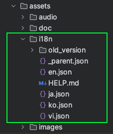

Chuyển đổi ngôn ngữ cho app flutter không sử dụng bên thứ 3

Chuyển đổi ngôn ngữ là điều quan trọng và cần thiết để ứng dụng của bạn tiếp cận toàn cầu. 

1. Chuyển đổi ngôn ngữ với file json 

Ưu điểm của cách này là có thể lưu trữ và tất cả các file ngôn ngữ sẽ được lưu dứoi dạng json, có thể tải những file json này từ server để đọc trên ứng dụng giúp giảm thời gian tải ứng dụng từ chợ úng dụng. 
Cách này thường được sử dụng với mobile app. Cách này không được sử dụng trong trang web này, tôi sẽ giới thiệu cách chuyển đổi ngôn ngữ trên web flutter vào phần sau. 

- Tạo mẫu json 

Hãy xem cách tôi thiết lập các file json trong hình. tôi có 4 ngôn ngữ là tiếng anh, tiếng nhật, tiếng hàn và tiếng việt,

Đây là nội dung bên trong file en.json
```json
{
  "welcomeBack": "Welcome Back",
  "welcomeBackNameApp": "Welcome @nameUser Back @nameApp"
}
```
Đây là nội dung bên trong file vi.json
```json
{
  "welcomeBack": "Chào mừng trở lại",
  "welcomeBackNameApp": "Chào mừng @nameUser trở lại @nameApp"
}
```
Hãy tương tựu lại với các file json của ngôn ngữ khác.
Bạn có thể thấy, chúng ta sẽ sử dụng key của các phần tử trong json để xác định ngôn ngữ này. 

Trước khi vào các phần chi tiết, tôi sẽ trình bày ý tưởng của tôi: 
Tôi sẽ đọc nội dụng trong file json, sau đó sử dụng thư viện shared_preferences https://pub.dev/packages/shared_preferences để lưu nội dụng đọc ra vào bộ nhớ thiết bị. 
Khi sử dụng chỉ việc lấy từ trong bộ nhớ ra để sử dụng, khi chuyển ngô ngữ thì sẽ lặp lại thao tác đó từ đầu. 

Trước tiên chúng ta sẽ custom lại thư viện shared_preferences 1 chút, đây là cách tôi tách biệt các thư viện ra khỏi project chính của tôi, việc này có ưu điểm là nó sẽ dễ dàng thay đổi các thư viện khác nếu trong tương lại nó ngừng hỗ trợ và giảm tối đa sự phúc tạo của thư viện khi đưa vào trong project, tôi đã tình bày trong bài viết package của tôi *LINK*
Tôi sẽ lược bớt các hàm không cần thiết và để lại các hàm chính là setup , read, write 

```dart
import 'dart:convert' as convert;

import 'package:flutter/cupertino.dart';
import 'package:shared_preferences/shared_preferences.dart';


class MyPrefs {
/*
    Learn more: https://pub.dev/packages/shared_preferences
    How to use?
        Step 1: Define
          MyPrefs myPrefs = MyPrefs();
        Step 2: Setup on init
          myPrefs.setUp();
        Step 3: E.g use
          myPrefs.write(constSaveLocale, locale.toString());
*/

  SharedPreferences? prefs;

  Future<void> setUp() async {
    prefs = await SharedPreferences.getInstance();
  }

  Future<bool> write(String key, dynamic value) async {
    final SharedPreferences prefs = this.prefs ??= await SharedPreferences.getInstance();
    if (value.runtimeType == String) {
      return tryBool(prefs.setString(key, value as String));
    } else if (value.runtimeType == int) {
      return tryBool(prefs.setInt(key, value as int));
    } else if (value.runtimeType == bool) {
      return tryBool(prefs.setBool(key, value as bool));
    } else if (value.runtimeType == double) {
      return tryBool(prefs.setDouble(key, value as double));
    } else if (value.runtimeType == List<String>) {
      return tryBool(prefs.setStringList(key, value as List<String>));
    } else if (value.runtimeType.toString() == "_Map<String, dynamic>") {
      return tryBool(prefs.setString(key, convert.jsonEncode(value as Map<String, dynamic>)));
    } else if (value.runtimeType == DateTime) {
      return tryBool(prefs.setString(key, value.toString()));
    } else {
      return Future(() => false);
    }
  }
  

  /// Đảm bảo rằng đã chạy setUp()
  Future<T?> read<T>(String key) async {
    try {
      final SharedPreferences prefs = this.prefs!;
      if (T == String) {
        return prefs.getString(key) as T;
      } else if (T == int) {
        return prefs.getInt(key) as T;
      } else if (T == bool) {
        return prefs.getBool(key) as T;
      } else if (T == double) {
        return prefs.getDouble(key) as T;
      } else if (T == List<String>) {
        return prefs.getStringList(key) as T;
      } else if (T == Map<String, dynamic>) {
        return prefs.getString(key) == null ? null : convert.jsonDecode(prefs.getString(key)!) as T;
      } else if (T == DateTime) {
        return prefs.getString(key) == null ? null : DateTime.parse(prefs.getString(key)!) as T;
      } else {
        return null;
      }
    } catch (error) {
      print(error, tag: "MyPrefs.read<$T> (input: $key)");
      return null;
    }
  }

}
```


trình bày 2 cách chuyển ngôn ngữ, chat gpt ứng dụng vào dịch ngôn ngữ,  tự động sinh code , cách cachs dichj ngôn ngữ tự động, 