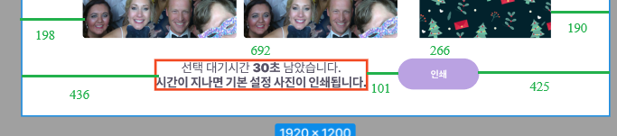
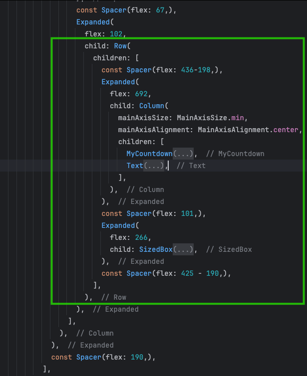

1. co giãn màn hình với mason theo từng loại mành hình đt,  
2. Theo tỉ lệ màn hình chia theo tưingf chiều màn hình 
3. Sử dụng Expand và Spear()
3. tỷ lệ font chữ tuỳ thoe kích thước màn hình  

# Hướng dẫn Responsive Screen trong Flutter
Responsive design là một phần quan trọng khi phát triển ứng dụng Flutter để đảm bảo ứng dụng có giao diện đẹp trên nhiều kích thước màn hình khác nhau. Bài viết này sẽ hướng dẫn bạn cách làm responsive theo các phương pháp khác nhau trong Flutter.

## 1. Cách co giãn màn hình với `responsive_builder` theo từng loại màn hình
- add ```responsive_builder: ^lastest_version``` in your `pubspec.yaml`

Thư viện responsive_builder giúp phân chia giao diện theo từng loại màn hình như mobile, tablet, desktop. Chúng ta có thể sử dụng ScreenTypeLayout.builder và OrientationLayoutBuilder để xử lý giao diện theo từng loại màn hình và hướng màn hình.

```dart
import 'package:flutter/material.dart';
import 'package:responsive_builder/responsive_builder.dart';

part 'responsive_screen_mobile.dart';
part 'responsive_screen_tablet.dart';
part 'part_screen/responsive_screen_body.dart';

class ResponsiveScreen extends StatelessWidget {
  const ResponsiveScreen({super.key});

  @override
  Widget build(BuildContext context) {
    final body = const ResponsiveScreenBody();
    return ScreenTypeLayout.builder(
      mobile: (_) => OrientationLayoutBuilder(
        portrait: (context) => ResponsiveScreenMobilePortrait(body: body),
        landscape: (context) => ResponsiveScreenMobileLandscape(body: body),
      ),
      tablet: (_) => OrientationLayoutBuilder(
        portrait: (context) => ResponsiveScreenTabletPortrait(body: body),
        landscape: (context) => ResponsiveScreenTabletLandscape(body: body),
      ),
    );
  }
}
```
### Mobile Layouts
```dart
import 'package:flutter/material.dart';
import 'package:responsive_builder/responsive_builder.dart';

part 'responsive_screen_mobile.dart';
part 'responsive_screen_tablet.dart';
part 'part_screen/responsive_screen_body.dart';

class ResponsiveScreen extends StatelessWidget {
  const ResponsiveScreen({super.key});

  @override
  Widget build(BuildContext context) {
    final body = const ResponsiveScreenBody();
    return ScreenTypeLayout.builder(
      mobile: (_) => OrientationLayoutBuilder(
        portrait: (context) => ResponsiveScreenMobilePortrait(body: body),
        landscape: (context) => ResponsiveScreenMobileLandscape(body: body),
      ),
      tablet: (_) => OrientationLayoutBuilder(
        portrait: (context) => ResponsiveScreenTabletPortrait(body: body),
        landscape: (context) => ResponsiveScreenTabletLandscape(body: body),
      ),
    );
  }
}
```
### Tablet Layouts
```dart
part of 'responsive_screen.dart';

class ResponsiveScreenTabletPortrait extends StatelessWidget {
  const ResponsiveScreenTabletPortrait({super.key, required this.body});
  final Widget body;

  @override
  Widget build(BuildContext context) {
    return Row(
      children: [
        const Spacer(flex: 130),
        Expanded(flex: 1180, child: body),
        const Spacer(flex: 130),
      ],
    );
  }
}

class ResponsiveScreenTabletLandscape extends StatelessWidget {
  const ResponsiveScreenTabletLandscape({super.key, required this.body});
  final Widget body;

  @override
  Widget build(BuildContext context) {
    return Row(
      children: [
        const Spacer(flex: 130),
        Expanded(flex: 1180, child: body),
        const Spacer(flex: 130),
      ],
    );
  }
}
```
## 2. Responsive theo tỷ lệ màn hình
Có thể sử dụng `MediaQuery` để xác định tỷ lệ màn hình và điều chỉnh UI phù hợp.
```dart
class ResponsiveWidget extends StatelessWidget {
  @override
  Widget build(BuildContext context) {
    double screenWidth = MediaQuery.of(context).size.width;
    double screenHeight = MediaQuery.of(context).size.height;

    return Container(
      width: screenWidth * 0.8, // Chiếm 80% chiều rộng màn hình
      height: screenHeight * 0.5, // Chiếm 50% chiều cao màn hình
      color: Colors.blue,
      child: const Center(child: Text("Responsive Container")),
    );
  }
}
```
## 3. Sử dụng `Expanded` và `Spacer`
`Expanded` giúp mở rộng các widget trong `Row` hoặc `Column`, trong khi `Spacer` giúp tạo khoảng trống linh hoạt.

For example, the image below has the following design and size:



Now use `Expanded` and `Space` to create the design


## 4. Điều chỉnh font chữ theo kích thước màn hình
Có thể sử dụng `MediaQuery` hoặc `responsive_builder` để thay đổi kích thước font chữ linh hoạt.
```dart
Text(
  "Responsive Text",
  style: TextStyle(fontSize: MediaQuery.of(context).size.width * 0.05),
)
```
# Conclusion
Việc làm responsive trong Flutter không khó khi sử dụng các thư viện hỗ trợ như `responsive_builder` hay `MediaQuery`. Áp dụng đúng phương pháp giúp ứng dụng hiển thị tốt trên nhiều thiết bị khác nhau.