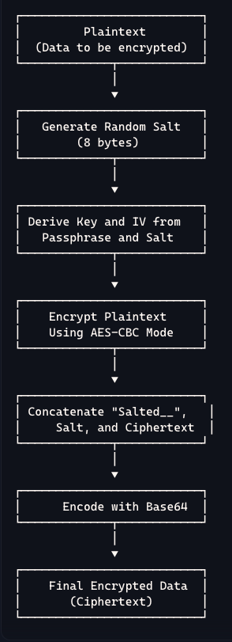
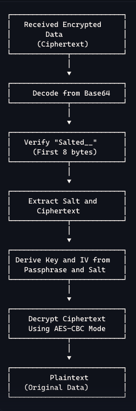

# Bảo Mật Mật Khẩu Trong Ứng Dụng Flutter: Hướng Dẫn Mã Hóa AES Với Salt và IV


## **1. Hiểu Về AES, Salt và IV**

- **AES (Advanced Encryption Standard):**

    - Là chuẩn mã hóa đối xứng mạnh mẽ và được sử dụng rộng rãi.
    - Sử dụng cùng một khóa cho cả mã hóa và giải mã.
    - An toàn và hiệu quả cho ứng dụng di động.

- **Salt là gì và tại sao cần sử dụng?**

    - **Salt** là một chuỗi dữ liệu ngẫu nhiên được thêm vào trước khi mã hóa.
    - Làm cho mỗi lần mã hóa cùng một dữ liệu với cùng passphrase sẽ cho ra kết quả khác nhau.
    - Ngăn chặn các tấn công dựa trên từ điển và bảng tra cứu.

- **IV (Initialization Vector):**

    - **IV** là một giá trị khởi tạo ngẫu nhiên được sử dụng trong các chế độ mã hóa như CBC.
    - Đảm bảo rằng cùng một plaintext mã hóa thành ciphertext khác nhau.

## **2. Áp dụng bào bảo mật 1 đoạn mật khẩu trong ứng dụng**

### **2.2. Hàm `encryptAESCryptoJS`**

- **Chức năng:**

    - Mã hóa một chuỗi văn bản (`plainText`) bằng cách sử dụng passphrase.
  
```dart
  String encryptAESCryptoJS(String plainText, String passphrase) {
    try {
      final salt = _genRandomWithNonZero(8);
      final keyndIV = _deriveKeyAndIV(passphrase, salt);
      final key = e.Key(keyndIV[0]);
      final iv = e.IV(keyndIV[1]);

      final encrypter = e.Encrypter(e.AES(key, mode: e.AESMode.cbc));
      final encrypted = encrypter.encrypt(plainText, iv: iv);
      final Uint8List encryptedBytesWithSalt = Uint8List.fromList(_createUint8ListFromString("Salted__") + salt + encrypted.bytes);
      return base64.encode(encryptedBytesWithSalt);
    } catch (error) {
      rethrow;
    }
  }
```

- **Cách hoạt động:**

    1. **Tạo Salt Ngẫu Nhiên:**

        - Sử dụng hàm `_genRandomWithNonZero(8)` để tạo một `salt` 8 byte ngẫu nhiên.
        - Salt đảm bảo tính ngẫu nhiên và an toàn cho quá trình mã hóa.
        ```dart
          Uint8List _genRandomWithNonZero(int seedLength) {
              final random = Random.secure();
              const int randomMax = 245;
              final Uint8List uint8list = Uint8List(seedLength);
              for (int i = 0; i < seedLength; i++) {
                uint8list[i] = random.nextInt(randomMax) + 1;
              }
              return uint8list;
          }
        ```
    2. **Dẫn Xuất Key và IV:**

       - Hàm `_deriveKeyAndIV(passphrase, salt)` tạo ra `key` và `IV` từ passphrase và salt.
       - Sử dụng hàm băm MD5 nhiều lần để tạo đủ dữ liệu cho key và IV.
         ```dart
            List<Uint8List> _deriveKeyAndIV(String passphrase, Uint8List salt) {
               final password = _createUint8ListFromString(passphrase);
               Uint8List concatenatedHashes = Uint8List(0);
               Uint8List currentHash = Uint8List(0);
               bool enoughBytesForKey = false;
               Uint8List preHash = Uint8List(0);
            
               while (!enoughBytesForKey) {
               final int preHashLength = currentHash.length + password.length + salt.length;
               if (currentHash.isNotEmpty) {
                preHash = Uint8List.fromList(currentHash + password + salt);
               } else {
                preHash = Uint8List.fromList(password + salt);
               }
            
                   currentHash = preHash.myMd5;
                   concatenatedHashes = Uint8List.fromList(concatenatedHashes + currentHash);
                   if (concatenatedHashes.length >= 48) enoughBytesForKey = true;
               }
            
               final keyBytes = concatenatedHashes.sublist(0, 32);
               final ivBytes = concatenatedHashes.sublist(32, 48);
               return [keyBytes, ivBytes];
           }
         ```
    3. **Mã Hóa Dữ Liệu:**

        - Sử dụng `key` và `IV` để mã hóa `plainText` bằng thuật toán AES trong chế độ CBC.
        - Kết quả mã hóa là một chuỗi byte.

    4. **Chuẩn Bị Dữ Liệu Mã Hóa Cuối Cùng:**

        - Ghép chuỗi `"Salted__"` + `salt` + `encrypted bytes`.
        - Mã hóa toàn bộ chuỗi trên bằng base64 để dễ dàng lưu trữ hoặc truyền tải.
        ```dart
          Uint8List _createUint8ListFromString(String s) {
            final ret = Uint8List(s.length);
            for (var i = 0; i < s.length; i++) {
              ret[i] = s.codeUnitAt(i);
            }
            return ret;
         }
        ```
- **Vì sao kết quả mã hóa khác nhau mỗi lần?**

    - Do `salt` được tạo ngẫu nhiên mỗi lần, nên dù cùng `plainText` và `passphrase`, kết quả mã hóa sẽ khác nhau.
    - Điều này tăng cường bảo mật và ngăn chặn các tấn công dựa trên việc so sánh kết quả mã hóa.

### **2.3. Hàm `decryptAESCryptoJS`**

- **Chức năng:**

    - Giải mã một chuỗi đã được mã hóa bằng hàm `encryptAESCryptoJS`.
  
```dart
 String decryptAESCryptoJS(String encrypted, String passphrase) {
  try {
    final Uint8List encryptedBytesWithSalt = base64.decode(encrypted);

    final Uint8List encryptedBytes = encryptedBytesWithSalt.sublist(16, encryptedBytesWithSalt.length);
    final salt = encryptedBytesWithSalt.sublist(8, 16);
    final keyndIV = _deriveKeyAndIV(passphrase, salt);
    final key = e.Key(keyndIV[0]);
    final iv = e.IV(keyndIV[1]);

    final encrypter = e.Encrypter(e.AES(key, mode: e.AESMode.cbc));
    final decrypted = encrypter.decrypt64(base64.encode(encryptedBytes), iv: iv);
    return decrypted;
  } catch (error) {
    rethrow;
  }
}
```

- **Cách hoạt động:**

    1. **Giải Mã Base64:**

        - Chuyển đổi chuỗi mã hóa từ dạng base64 về dạng byte gốc.

    2. **Tách Salt và Dữ Liệu Mã Hóa:**

        - Bỏ đi 8 byte đầu tiên (`"Salted__"`).
        - Lấy `salt` (8 byte tiếp theo).
        - Lấy dữ liệu mã hóa từ vị trí còn lại.

    3. **Dẫn Xuất Lại Key và IV:**

        - Sử dụng cùng hàm `_deriveKeyAndIV` với `passphrase` và `salt` lấy được.

    4. **Giải Mã Dữ Liệu:**

        - Sử dụng `key` và `IV` để giải mã dữ liệu mã hóa bằng AES trong chế độ CBC.
        - Kết quả là `plainText` ban đầu.

### **3.4. Hàm `verify` và `verifyEncrypted`**

- **Mục đích:**

    - Xác minh tính toàn vẹn và chính xác của quá trình mã hóa và giải mã.

    - **Cách hoạt động:**

    - `verify`: So sánh `plainText` ban đầu với kết quả giải mã từ chuỗi mã hóa.
      ```dart
            bool verify({
              required String text,
              required String encrypted,
              required String passphrase,
            }) {
              try {
               return text == decryptAESCryptoJS(encrypted, passphrase);
              } catch (e) {
               return false;
              }
           }
      ```
    - `verifyEncrypted`: Giải mã hai chuỗi mã hóa và so sánh kết quả.
      ```dart
              bool verifyEncrypted({
              required String encrypted1,
              required String encrypted2,
              required String passphrase,
              }) {
                  if (encrypted1 == encrypted2) return false;
                  try {
                    return decryptAESCryptoJS(encrypted1, passphrase) == decryptAESCryptoJS(encrypted2, passphrase);
                  } catch (e) {
                    return false;
                  }
              }
      ```

## **4. Hướng Dẫn Sử Dụng Đoạn Code Trong Dự Án Flutter**

### **4.1. Cài Đặt Thư Viện**

- Thêm vào `pubspec.yaml`:

  ```yaml
  dependencies:
    encrypt: ^5.0.1
    dart_core: ^1.0.0
  ```

- Chạy lệnh:

  ```
  flutter pub get
  ```

### **4.2. Sử Dụng Hàm Mã Hóa và Giải Mã**
- **Hãy ghép các đoạn code trên vào 1 class MyEncrypt**
```dart
import 'dart:convert';
import 'dart:math';
import 'dart:typed_data';

import 'package:dart_core/dart_core.dart';
import 'package:encrypt/encrypt.dart' as e;
// import 'package:flutter/services.dart';

class MyEncrypt {
    const MyEncrypt();
    
    /*
    Learn more | https://pub.dev/packages/encrypt
    
    Generate password
    Run |
    flutter pub global activate encrypt
    secure-random
    
    */
    
    // #TESTED
    String encryptAESCryptoJS(String plainText, String passphrase) {
    try {
        final salt = _genRandomWithNonZero(8);
        final keyndIV = _deriveKeyAndIV(passphrase, salt);
        final key = e.Key(keyndIV[0]);
        final iv = e.IV(keyndIV[1]);
    
          final encrypter = e.Encrypter(e.AES(key, mode: e.AESMode.cbc));
          final encrypted = encrypter.encrypt(plainText, iv: iv);
          final Uint8List encryptedBytesWithSalt = Uint8List.fromList(_createUint8ListFromString("Salted__") + salt + encrypted.bytes);
          return base64.encode(encryptedBytesWithSalt);
        } catch (error) {
          rethrow;
        }
    }
    
    // #TESTED
    String decryptAESCryptoJS(String encrypted, String passphrase) {
    try {
    final Uint8List encryptedBytesWithSalt = base64.decode(encrypted);
    
          final Uint8List encryptedBytes = encryptedBytesWithSalt.sublist(16, encryptedBytesWithSalt.length);
          final salt = encryptedBytesWithSalt.sublist(8, 16);
          final keyndIV = _deriveKeyAndIV(passphrase, salt);
          final key = e.Key(keyndIV[0]);
          final iv = e.IV(keyndIV[1]);
    
          final encrypter = e.Encrypter(e.AES(key, mode: e.AESMode.cbc));
          final decrypted = encrypter.decrypt64(base64.encode(encryptedBytes), iv: iv);
          return decrypted;
        } catch (error) {
          rethrow;
        }
    }
    
    bool verify({
    required String text,
    required String encrypted,
    required String passphrase,
    }) {
        try {
          return text == decryptAESCryptoJS(encrypted, passphrase);
        } catch (e) {
          return false;
        }
    }
    
    bool verifyEncrypted({
    required String encrypted1,
    required String encrypted2,
    required String passphrase,
    }) {
        if (encrypted1 == encrypted2) return false;
        try {
          return decryptAESCryptoJS(encrypted1, passphrase) == decryptAESCryptoJS(encrypted2, passphrase);
        } catch (e) {
          return false;
        }
    }
    
    List<Uint8List> _deriveKeyAndIV(String passphrase, Uint8List salt) {
    final password = _createUint8ListFromString(passphrase);
    Uint8List concatenatedHashes = Uint8List(0);
    Uint8List currentHash = Uint8List(0);
    bool enoughBytesForKey = false;
    Uint8List preHash = Uint8List(0);
    
        while (!enoughBytesForKey) {
          final int preHashLength = currentHash.length + password.length + salt.length;
          if (currentHash.isNotEmpty) {
            preHash = Uint8List.fromList(currentHash + password + salt);
          } else {
            preHash = Uint8List.fromList(password + salt);
          }
    
          currentHash = preHash.myMd5;
          concatenatedHashes = Uint8List.fromList(concatenatedHashes + currentHash);
          if (concatenatedHashes.length >= 48) enoughBytesForKey = true;
        }
    
        final keyBytes = concatenatedHashes.sublist(0, 32);
        final ivBytes = concatenatedHashes.sublist(32, 48);
        return [keyBytes, ivBytes];
    }
    
    Uint8List _createUint8ListFromString(String s) {
        final ret = Uint8List(s.length);
        for (var i = 0; i < s.length; i++) {
          ret[i] = s.codeUnitAt(i);
        }
        return ret;
    }
    
    Uint8List _genRandomWithNonZero(int seedLength) {
        final random = Random.secure();
        const int randomMax = 245;
        final Uint8List uint8list = Uint8List(seedLength);
        for (int i = 0; i < seedLength; i++) {
          uint8list[i] = random.nextInt(randomMax) + 1;
        }
        return uint8list;
    }
}
```

- **Mã hóa dữ liệu:**

  ```dart
  final encryptHelper = MyEncrypt();
  final plainText = "Dữ liệu cần mã hóa";
  final passphrase = "Mật khẩu bí mật";

  final encryptedText = encryptHelper.encryptAESCryptoJS(plainText, passphrase);
  ```

- **Giải mã dữ liệu:**

  ```dart
  final decryptedText = encryptHelper.decryptAESCryptoJS(encryptedText, passphrase);
  ```

- **Xác minh kết quả:**

  ```dart
  final isVerified = encryptHelper.verify(
    text: plainText,
    encrypted: encryptedText,
    passphrase: passphrase,
  );
  ```

### **4.3. Lưu Ý Khi Sử Dụng**

- **Bảo vệ `passphrase`:**

    - Không nên lưu trữ passphrase dưới dạng văn bản thuần trong mã nguồn hoặc cơ sở dữ liệu.
    - Sử dụng các biện pháp bảo vệ như biến môi trường hoặc dịch vụ quản lý bí mật.

- **Quản lý khóa và dữ liệu nhạy cảm:**

    - Hạn chế quyền truy cập vào phần mã liên quan đến mã hóa.
    - Tuân thủ các quy định và tiêu chuẩn về bảo mật dữ liệu.

## **5. Tại Sao Sử Dụng Salt và IV Lại Quan Trọng?**

- **Salt:**

    - Ngăn chặn tấn công dựa trên từ điển và bảng rainbow table.
    - Mỗi `salt` ngẫu nhiên làm cho kết quả mã hóa độc nhất.
    - Nếu không có Salt, kẻ tấn công có thể so sánh các ciphertext để tìm ra các mẫu.
    - Điều này đặc biệt nguy hiểm nếu nhiều người dùng có cùng passphrase hoặc dữ liệu nhạy cảm.
    - Sử dụng Salt giống như thêm gia vị độc đáo vào món ăn, khiến mỗi lần nấu đều có hương vị riêng.
    - Điều này làm cho kẻ xấu không thể đoán được "công thức" của bạn.

- **IV (Initialization Vector):**

    - Đảm bảo an toàn cho chế độ mã hóa CBC.
    - Ngăn chặn các mẫu lặp lại trong dữ liệu mã hóa.

## **6. Kết Luận**

- **Bảo mật không chỉ là một tùy chọn, mà là một yêu cầu bắt buộc trong phát triển ứng dụng.**
- **Sử dụng mã hóa AES cùng với Salt và IV giúp bảo vệ dữ liệu người dùng một cách hiệu quả.**
- **Hi vọng với bài viết này, bạn và đồng nghiệp có thể triển khai giải pháp bảo mật cho ứng dụng Flutter một cách dễ dàng và an toàn.**

**Tài liệu tham khảo:**

- [Tài liệu về thư viện `encrypt` trên pub.dev](https://pub.dev/packages/encrypt)
- [Hiểu về AES Encryption](https://vi.wikipedia.org/wiki/Advanced_Encryption_Standard)
- [Thực hành bảo mật trong Flutter](https://flutter.dev/docs/development/data-and-backend/encryption)


