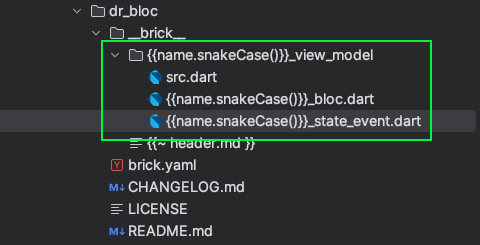

1. Tại sao nên dùng bloc 

Bloc https://bloclibrary.dev/ xây dựng dựa trên provider của flutter, đây là thư viện được đánh đấu Favourite cùa Flutter https://pub.dev/packages/provider
Nó giúp tối giản dòng code của provider. Đây cũng là 1 trong những state management tốt nhất cho Flutter hiện tại. 

Bloc sẽ phức tạp với người mới bắt đầu học Flutter nhưng so với các state management đơn giản như Getx https://pub.dev/packages/get thì Bloc tỏ ra tiện lợi và tối ưu hoá sự render lại của màn hình tốt hơn. Bloc hay Riverpod https://riverpod.dev/
đều xây dựng dựa trên provider, nên bạn có thể lựa chọn công cụ quản lý state tuỳ theo sở thích. Bloc cũng cung cấp cách quản lý state đơn giản với tên gọi là Cubit https://bloclibrary.dev/bloc-concepts/ nên việc thành thạo Bloc sẽ giúp bạn có lợi thế cho cả dự án quy mô nhỏ, và dự án quy mô lớn. 
Thường các dự án quy mô lớn sẽ sử dụng Bloc https://bloclibrary.dev/bloc-concepts/#bloc nhưng việc sử dụng nó yêu cầu phải viết lượng code lớn, Mason sẽ là giải pháp cho vấn đề này, tôi sẽ trình bày cách tôi tự động tạo mẫu code Bloc của tôi trong phần tiếp theo. 

Bên cạnh cung cấp giải pháp cho việc quản lý state, Bloc còn cung cấp các giải pháp khác mà tôi thường sử dụng như lưu trữ cache hoặc bộ nhớ các trạng thái của Bloc (hữu dụng khi sử dụng lưu trữ setting của ứng dụng).  Redo, Undo trạng thái. Tham khảo tại https://bloclibrary.dev/getting-started/#packages

2. Code nhanh hơn với Mason


Bạn có thể tham khảo mẫu Bloc xây dựng của tôi tại dr_bloc https://brickhub.dev/bricks/dr_bloc và xây dụng 1 cái cho riêng bản thân mình. Nếu bạn chưa biết sử dụng mason, hãy tham khảo https://wongcoupon.com/en/doc/help/flutter/boost-your-flutter-development-efficiency-with-mason


Bloc của tôi được xây dựng là 1 phần của kiến trức MVVM, Giao diện sẽ giao tiếp trực tiếp với Bloc và Bloc sẽ có nhiệm vũ lấy dữ liệu từ các repository, bạn có thể tham khảo trực tiếp kiến trúc của Bloc tại https://bloclibrary.dev/architecture/, nếu bạn muốn triển hai nó vào trong kiến trức clean architecture thì hãy tham khảo bài viết https://wongcoupon.com/en/doc/help/flutter/maintain-and-extend-code-easier-with-clean-architecture. 
Đa phần chúng ta sẽ quen với 1 form code nhất định, nhưng khi chuyển sang các dự án khác, việc viết lại từ đầu sẽ làm chậm quá trình phát triển ứng dụng. Các module đơn giản chúng ta có thể sử dụng Cubit nhưng với các module lớp và phức tạo khiến chúng ta phải sử dụng các quản lý trạng thái tường minh và rõ ràng hơn.  

Bloc của tôi sẽ được thiết kế thành 1 thư mực gồm 2 phần: 
Phần 1 là bloc chịu trách nghiệm xử lý thông tin trạng thía. 
Phần 2 tôi sẽ gộp cả event và state lại làm 1 vì chúng không quá dài và giảm thiếu số lượng file không cần thiết, bên cạnh đó tôi sử dụng thư viện json_serializable https://pub.dev/packages/json_serializable cho trường hợp nếu muốn lưu trữ trạng thái vào bộ nhớ máy sử dụng hydrated_bloc và replay_bloc

Phần này chứa trạng thái của bloc, chúng ta có thể thêm enum trạng thái hoặc setting mặc định cho ứng dụng sẽ được khởi tạo ở đây.
```dart
/// Part I: State
// BlocSubject + State
// Learn more: https://bloclibrary.dev/naming-conventions/#single-class
@JsonSerializable(explicitToJson: true)
final class {{name.pascalCase()}}State extends Equatable {
    const {{name.pascalCase()}}State({
      this.user,
    })
    // : Setup Object: https://dart.dev/codelabs/dart-cheatsheet#initializer-lists
        ;
    
    // Default value
    static const {{name.pascalCase()}}State origin = {{name.pascalCase()}}State();
    
    // @JsonKey(
    //   includeFromJson: false,
    //   includeToJson: false
    // )
    final String? user;
    
    {{name.pascalCase()}}State copyWith({
        String? user,
        // User? Function()? user,
    }) {
    return {{name.pascalCase()}}State(
        user: user ?? this.user,
        // user: user != null ? user() : this.user,
        );
    }
    
    @override
    List<dynamic> get props => [
      user,
    ];
    
    factory {{name.pascalCase()}}State.fromJson(MyJsonMap json) => _${{name.pascalCase()}}StateFromJson(json);
    
    MyJsonMap toJson() => _${{name.pascalCase()}}StateToJson(this);
    
    @override
    String toString() {
      return '''{{name.pascalCase()}}State  ${toJson().myPrintMapJson}''';
    }
}
```

Phần này sẽ chứa các event của bloc 
```dart
/// Part II: Event
// Learn more: https://bloclibrary.dev/naming-conventions/#anatomy
// BlocSubject + Noun (optional) + Verb (event)
sealed class {{name.pascalCase()}}Event
// extends ReplayEvent
{
  const {{name.pascalCase()}}Event();
}
final class {{name.pascalCase()}}Pressed extends {{name.pascalCase()}}Event {
    const {{name.pascalCase()}}Pressed();
    // final String something;
    // const {{name.pascalCase()}}Pressed({required this.something});
}
```

Phần này sẽ chứa bloc bạn có thể tuỳ chỉnh function của mình tại đây 
```dart
/// Part III: Bloc
// Learn more bloc: https://bloclibrary.dev/bloc-concepts/#bloc
class {{name.pascalCase()}}Bloc extends Bloc<{{name.pascalCase()}}Event, {{name.pascalCase()}}State> {
    {{name.pascalCase()}}Bloc() : super({{name.pascalCase()}}State.origin) {
      on<{{name.pascalCase()}}Pressed>(on{{name.pascalCase()}}Pressed);
    }
    
    Future<void> on{{name.pascalCase()}}Pressed({{name.pascalCase()}}Pressed event, Emitter<void> emit) async {
      emit(state);
    }
}
```

Trong file bloc tôi đã chuẩn bị tạo sẵn code cho cubit, bạn có thể bỏ comment để sử dụng chúng, hoặc xoá chúng đi nếu cảm thấy không cần thiết. 
```dart
class {{name.pascalCase()}}Cubit extends Cubit<{{name.pascalCase()}}State> {
    {{name.pascalCase()}}Cubit() : super({{name.pascalCase()}}State.origin);
    
    void on{{name.pascalCase()}}Pressed() {
      emit(state);
    }
    
    @override
    void onChange(Change<{{name.pascalCase()}}State> change) {
      super.onChange(change);
      myLog.trace(change);
    }
    
    @override
    void onError(Object error, StackTrace stackTrace) {
      myLog.trace('$error, $stackTrace');
      super.onError(error, stackTrace);
    }
}
```
Để bloc hoạt động ta cần thêm chúng vào BlocProvider, dưới đây là 1 ví dụ về việc khai báo bloc trước khi sử dụng 

```dart
 MultiBlocProvider(
      providers: [
        BlocProvider (
          create: (BuildContext context) => ABloc(),
        ),
        BlocProvider (
          create: (BuildContext context) => BBloc(),
        ),
        ...
      ],
      child: const AppView(),
    );
```

Cuối cùng đừng bỏ lỡ các extention của bloc dành cho IDE như Android Studio để giúp bạn code nhanh hơn. Hoặc tạo ra các live template để sử dụng lại nhiều lần.

3. Debug, tuy xuất các sự kiện thay đổi trong bloc 

Phần này đã được giới thiệu sẵn trong tài liệu của bloc, thường thì nó sẽ chỉ cần thiết cho các bloc nào quan trọng mà chúng ta muốn quan sát cách event hoạt động hoặc truy xuất lỗi.  
```dart
/// Logging state area
  @override
  void onChange(Change<{{name.pascalCase()}}State> change) {
    super.onChange(change);
    // myLog.trace(change);
  }

  // capture information about what triggered the state change
  // Learn more: https://bloclibrary.dev/bloc-concepts/#:~:text=One%20key%20differentiating,overriding%20onTransition.
  @override
  void onTransition(Transition<{{name.pascalCase()}}Event, {{name.pascalCase()}}State> transition) {
    super.onTransition(transition);
    myLog.trace(transition);
  }

  @override
  void onEvent({{name.pascalCase()}}Event event) {
    super.onEvent(event);
    // myLog.trace(event);
  }

  @override
  void onError(Object error, StackTrace stackTrace) {
    myLog.trace('$error, $stackTrace');
    super.onError(error, stackTrace);
  }
```

Cũng có 1 cách khác để luôn lắng nghe các thay đổi này mà không phải viết vào từng bloc riêng biệt 

```dart
/// {@template app_bloc_observer}
/// Custom [BlocObserver] that observes all bloc and cubit state changes.
/// {@endtemplate}
class OurBlocObserver extends BlocObserver {
/// {@macro app_bloc_observer}
    const OurBlocObserver();
    @override
    void onChange(BlocBase<dynamic> bloc, Change<dynamic> change) {
        super.onChange(bloc, change);
        if (bloc is Cubit) {
          myLog.trace(change.toString().myPrintStringJson, flag: "Blog");
        }
    }

    @override
    void onTransition(
    Bloc<dynamic, dynamic> bloc,
    Transition<dynamic, dynamic> transition,
    ) {
      super.onTransition(bloc, transition);
      // myLog.trace((transition.toString().myToStringJson() ?? "").myPrintStringJson, flag: "Blog");
    }
    
    @override
    void onError(BlocBase bloc, Object error, StackTrace stackTrace) {
      myLog.warning('${bloc.runtimeType} $error $stackTrace');
      super.onError(bloc, error, stackTrace);
    }
}
```
Hãy Gọi nó sau khi ứng dụng được khởi tạo hoàn toàn như sau 
```dart
WidgetsFlutterBinding.ensureInitialized();

Bloc.observer = const OurBlocObserver();
```

4. lưu trạng thái của bloc vào bộ nhớ thiết bị để giữ lại trạng thái cho lần khởi tạo lần sau. 

Save bloc to vào bộ nhớ máy tham khảo tại: https://pub.dev/packages/replay_bloc#replayblocmixin
STEP 1: Replace 
```dart
{{name.pascalCase()}}Event
```
 thành 
```dart
sealed class {{name.pascalCase()}}Event extends ReplayEvent {}
```

STEP 2: Replace 
```dart
{{name.pascalCase()}}Bloc
```
Thành 
```dart
    class {{name.pascalCase()}}Bloc extends HydratedBloc<{{name.pascalCase()}}Event, {{name.pascalCase()}}State> with ReplayBlocMixin {

```
Sau đó import 2 thư viện sau 
```dart
import 'package:hydrated_bloc/hydrated_bloc.dart';
import 'package:replay_bloc/replay_bloc.dart';
```

STEP 3: Add 2 function sau vào trong class {{name.pascalCase()}}Bloc

```dart
@override
{{name.pascalCase()}}State? fromJson(MyJsonMap json) {
  return {{name.pascalCase()}}State.fromJson(json);
}

@override
MyJsonMap? toJson({{name.pascalCase()}}State state) {
  return state.toJson();
}
```

STEP 4: khởi tạo HydratedBloc sau khi ứng dụng được khởi tạo thành công. 
MyFlutter là một thư viện core của tôi, bạn có thể tìm đường dẫn khác thông qua hướng dẫn của thư viện tại https://pub.dev/packages/hydrated_bloc#usage
```dart
WidgetsFlutterBinding.ensureInitialized();

    HydratedBloc.storage = await HydratedStorage.build(
      storageDirectory: kIsWeb
          ? HydratedStorage.webStorageDirectory
          : await MyFlutter.file.appDocumentsDir,
     );
}
```

5. Gọi bloc ở bất kỳ đâu trong project

Đây là ví dụ cách tôi có thể truy cập context ở bất kỳ đâu: 
```dart
  final isUsageTimeLimit = myNavigatorKey.currentContext!.read<SettingBloc>().state.setting.otherSetting.isUsageTimeLimit;
```
Hãy tham khảo bài viết về context anywhere của tôi tại đây để biết cách thiết lập chúng. 

Trên đây là cách tôi sử dụng bloc cho các dự án của mình, bạn có thể dựa bào nó để tự tạo cho bản thân 1 mẫu code phù hợp với các dự án của các bạn để giảm thiểu thời gian tạo mã nhưng vẫn đảm bảo có được toàn bộ sức mạnh của bloc 


