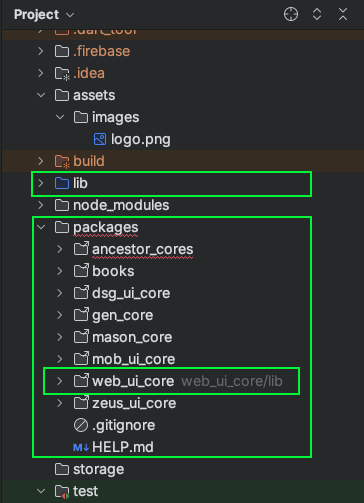
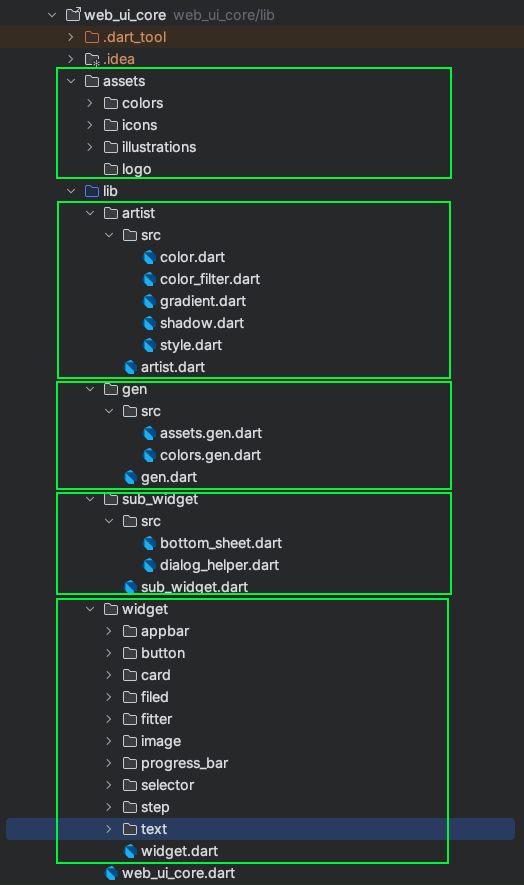
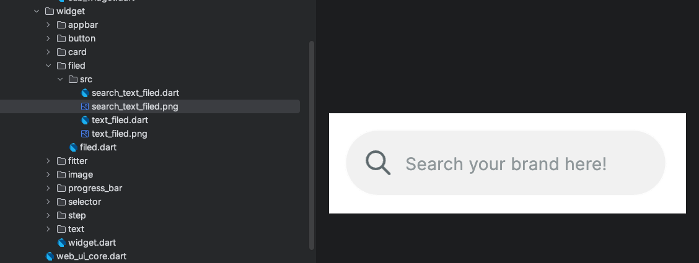

Tái sử dụng các ui Bạn đã xây dựng 

Xây dựng 1 mẫu UI từ Fixma trong Flutter khá tốn công sức, từ kiểu chữ, form chữ, màu sắc, đến các widget sử dụng trong ứng dụng.
Thường các dự án cá nhân, chúng ta sẽ luôn sử dụng lại các mẫu giao diện chúng ta đã từng tạo để giảm thời gian xây dựng ứng dụng, ví dụ như ứng dụng web và app có giao diện gần như tương tự nhau. 
Việc tách biệt phần code giao diện có thể dùng lại ra 1 phần khác của úng dụng là 1 cách clean code và cũng áp dụng kiến thức trong lập tình hướng đối tượng. 
Ngoài ra có thể biến nó thành nhiều theme trong ứng dụng của bạn. 

1. Tổng quan cách xây dựng 1 core ui cho ứng dụng. 
Hãy thử nhìn vào trang web https://wongcoupon.com/, nó được xây dựng bằng flutter và tôi sẽ trình bày cho bạn về cách tôi xây dựng UI tách biệt cho ứng dụng web của tôi 


Như trong hình, tôi tách toàn bộ các ui vào trong thư mục packages ở bên ngoài của thử mục lib, và đặt tên nó là web_ui_core, 
bạn có thể thấy có 1 số core ui khác của tôi ở xung quang đó, chúng có thể được tái sử dụng trong 1 vài dự án trong tương lai. 
Bạn có thể sẽ thắc mắc làm cách nào mà tôi đồng bộ được các package này với các project khác thì câu trả lời là tôi sử dụng git để đồng bộ chúng, tôi sẽ trình bày rõ hơn trong bài viết package *LINK* 


Trên đây là hình ảnh cách tôi triển khai 1 package ui trong thực tế cho trang web này. Cách này áp dụng tương tự với việc tôi triển khai cho UI của các ứng dụng di động. 
Tôi chi nó thành 5 phần chính: 
thư mục assets chứa màu sắc, icon svg và các hình ảnh được sử dụng liên quan đến ui. Những hình ảnh không liên quan đến UI sẽ được tách ra ngoài. Tôi sử dụng thư viện flutter_gen_runner https://pub.dev/packages/flutter_gen_runner 
để lấy các đường dẫn của chúng 1 cách nhanh chóng và không nhầm lẫn, tất cả chúng sẽ được tự đông sinh ra trong thư mục gen, tôi sẽ trình bày rõ hơn vào phần sau. 

thư mục artist, đây là nơi chứa màu sắc, các phép biến đổi màu cho svg và widget, màu gradient , shadow cho widget và cả style , tôi đã viết 1 bài viết ngắn về việc chuyển đổi giữa dark theme và light theme, *LINK*

Thư mục widget chứa các widget có thể tái sử dụng lại ở nhiều chỗ, 


Đây là 1 ví dụ về cách tôi tạo 1 mục nhập tìm kiếm tên là search_text_filed, bên cạnh đó tôi sẽ chụp lại màn hình để sau này dễ dàng giao tiếp với các đồng nghiệp khác, giúp tiết kiệm thời gian tìm kiếm các widget mà đồng nghiệp khác đã code rồi. 

Thư mục sub_widget chứa các màng hình phụ như dialog và bottom sheet. Thường các dialog phổ biến như dialog confirm, dialog thông báo, dialog nhập ngày giờ. 

2. Cách thiết lập 1 package core ui 
Qua các phần được thiết lập ở trên, bạn sẽ thấy khá là nhiều thư mục, nên tôi đã có giải pháp cho vấn đề này đó là sử dụng mason, nếu bạn chưa biết gì về mason hay tham khảo bài viết của tôi tại *LINK*
Bạn có thể tham khảo mẫu code của tôi và thiết lập 1 cái cho riêng bản thân mình vì bài viết này còn thiếu 1 vài thư viện lõi, đây là mẫu code của tôi dr_ui_core https://brickhub.dev/bricks/dr_ui_core

Sau đây tôi sẽ trình bày về cách tôi tạo 1 core ui của cá nhân tôi

Bước 1: thiếp lập package 
Bược đầu tiên là tạo 1 package chứa các UI mà bạn sắp sửa thêm vào, hãy đặt tên nó ... + _ui_core, như vậy chúng ta sẽ phân biệt được core ui và các core khác.  Hãy tham khảo bài viết này *LINK* của tôi về cách tôi sắp xếp các package.  
Tạo 1 folder ngoài thư mục lib tên là packages sau đó chạy câu lệnh

```
cd pathTo/packages

flutter create --template=package web_ui_core
```

Bước 2: Sau đó sẽ tiến hành thêm các thư viện giúp việc code trở nên sạch sẽ hơn bằng cách chạy câu lệnh 
```
cd pathTo/web_ui_core
flutter pub add lint
flutter pub add test
flutter pub add mockito
```
Tôi khuyến nghị bạn sử dụng thư viện lint https://pub.dev/packages/lint , đây là thư viện khiến code trở nên tường minh và tuân theo Effective Dart **https://dart.dev/effective-dart**, tôi sẽ trình bày chi tiết hơn trong bài viết này *LINK* 

Bước 3: replace file analysis_options.yaml
```yaml
include: ../../analysis_options.yaml
```

file analysis_options.yaml của package sẽ follow theo file analysis_options.yaml của toàn project, 
tôi sẽ chia sẻ mẫu analysis_options.yaml tôi sử dụng trong project của dự án tạo nên trang web này 

```yaml
# This file configures the analyzer to use the lint rule set from `package:lint`

include: package:lint/strict.yaml # For production apps
# include: package:lint/casual.yaml # For code samples, hackathons and other non-production code
# include: package:lint/package.yaml # Use this for packages with public API


# You might want to exclude auto-generated files from dart analysis
analyzer:
  errors:
    invalid_annotation_target: ignore
  plugins:
    - custom_lint
  exclude:
    - packages/mason_core/**
    - '**.freezed.dart'
    - '**.g.dart'

# You can customize the lint rules set to your own liking. A list of all rules
# can be found at https://dart-lang.github.io/linter/lints/options/options.html
linter:
  rules:
    - unawaited_futures
rules:
  # Util classes are awesome!
  # avoid_classes_with_only_static_members: false

  # Make constructors the first thing in every class
  # sort_constructors_first: true

  # Choose wisely, but you don't have to
  prefer_double_quotes: true
  prefer_single_quotes: true
  avoid_dynamic_calls: true
  lines_longer_than_80_chars: true
  avoid_classes_with_only_static_members: true
  use_named_constants: true

```


bước 4: Tôi sẽ sử dụng mason để sinh ra mẫu code mà tôi đã tạo sẵn được giới thiệu ở trển đầu bài viết. 

```
cd pathTo/mason
mason make dr_ui_core -o pathTo/lib
```
copy các thư mục trong thư mục out_site_lib ra ngoài thư mục lib của package.
Bước 5: Thiết lập flutter_gen_runner https://pub.dev/packages/flutter_gen_runner

```
fluttergen -c pubspec.yaml
```
Thư viện sẽ giúp sử dụng các tài nguyên trong assets 1 cách đơn giản hơn và giảm thiểu khẳ năng gây lỗi, hãy tìm hiểu bài viết của code nhanh hơn của tôi tại  *LINK*, 
tất cả các thiết lập cho flutter_gen_runner tôi đã thiết lập sẵn trong mẫu code. 

Bước 6: thêm package vào trong project trong file pubspec.yaml của dự án.
```yaml
dependencies:
  
  web_ui_core:
    path: packages/web_ui_core
```

Sau khi thiết lập, bạn sẽ thấy bị thiếu 1 package file ui_core, đây là package lõi, những sẽ không ảnh hưởng gì nếu bạn xoá chúng đi và tự tạo 1 cái cho riêng bản thân mình, 
tôi sễ trình bày các phần thiếu đó trong phần sau. Thư viện ui_core này sẽ cần 1 bài viết dài để trình bày, tôi sẽ giới thiệu nó trong thời gian sắp tới. 


3. Giải thích các phần trong việc thiết lập giao diện cơ bản
+ Giao diện sáng tối: tôi đã có 1 bài viết riêng trình bày về phần giao diện này tại *LINK*
```dart
extension WebColorContext on BuildContext{
  Color get white => isDarkMode ? WebColor.blackForDark : WebColor.white;
}

```
Chi tiết về biến isDarkMode
```dart
extension MyThemeModeContext on BuildContext{
  bool get isDarkMode => switch(myThemeMode) {
    ThemeMode.system => MediaQuery.of(this).platformBrightness == Brightness.dark,
    ThemeMode.light => false,
    ThemeMode.dark => true,
  };
}
```
Cách sử dụng 
```dart
 context.white
```

+ font chữ: Chúng ta sẽ đốt mặt với vấn đề là kích thước font chữ cần thay đổi khi kích thước màn hình thay đổi, vd như màn hình trên điện thoại và trên web khác nhau, bạn có thể quan sát trực tiếp tại trang web này, 
kích thước font chữ sẽ thay đổi khi màn hình có kích thước lớn và nhỏ lại với các màn hình điện thoại, hãy tham khảo cách tôi làm nó như sau
```dart
extension WebTextStyle on BuildContext{
/*static const _neoTextStyle = TextStyle(
fontFamily: WebFontFamily.nanumSquareNeo,
fontFamilyFallback: [
WebFontFamily.pretendard,
],
package: 'dsg_ui_core', // Thêm thư viện front chữ từ package: https://api.flutter.dev/flutter/painting/TextStyle-class.html#:~:text=To%20use%20a%20font%20family%20defined%20in%20a%20package%2C%20the%20package%20argument%20must%20be%20provided.%20For%20instance%2C%20suppose%20the%20font%20declaration%20above%20is%20in%20the%20pubspec.yaml%20of%20a%20package%20named%20my_package%20which%20the%20app%20depends%20on.%20Then%20creating%20the%20TextStyle%20is%20done%20as%20follows%3A
height: 1.5,
leadingDistribution:  TextLeadingDistribution.even,
color: WebColor.blackText555164,
); */
  static final _webTextStyle = GoogleFonts.inter().copyWith(
    fontWeight: FontWeight.w600,
    height: 1.5,
    leadingDistribution: TextLeadingDistribution.even,
// color: WebColor.neutral80,
  );

  /// Edit ratio of fontSize for responsive screen
  double get webRatio {
    final width = MediaQuery.of(this).size.width;
    final ratio = width / 1440;
// final textScaleFactor = ratio < 1 ? ratio < 0.8 ? 0.8 : ratio : 1;
// if (width > 600) {
//   return 1.5*textScaleFactor;
// } else if (width > 400) {
//   return 1.2*textScaleFactor;
// } else {
//   return 1.0*textScaleFactor;
// }
    return ratio < 1 ? ratio < 0.75 ? 0.75 : ratio : 1;
  }

  /// Heading

  TextStyle get h46B =>
      _webTextStyle.copyWith(
        fontSize: 46 * webRatio,
        fontWeight: FontWeight.w700,
        color: neutral80,
      );
}
```
Trong đoạn code trên chúng ta có thể thấy tôi đã chia tỉ lệ của màn hình theo chiều ngang tại biến webRatio, lấy tỉ lệ của kích thước chiều ngang hiện tại của màn hình 
chia cho chiều ngang được thiết kế trong figma, nhưng lấy trong khoảng tỷ lệ 0,75 đến 1 đế kích thước của chứ không bị quá nhỏ khi thu nhỏ màn hình.  
Bên cạnh đó tôi sử dụng GoogleFonts để thuận tiện cho việc thêm font chữ, bạn có thể thêm font chữ của tiêng bạn bằng cách tham khảo phần comment của tôi.

Cách sử dụng
```dart
 Text("Hello", style: context.h46B)
```
Chúng ta hoàn toàn có thể tuỳ chỉnh style theo 1 kiểu design riêng biệt, sau đây là 1 cách tuỳ chỉnh với màu.  
```dart
 Text("Hello", style: context.b10B.copyWith(
    color: context.neutral00,
    ),
```

+ widget: Việc sử dụng lấy tỷ lệ của màn hình và kích thước trong figma sẽ được sử dụng phổ biến trong việc costom widget 
hãy xem ví dụ sau về cách tôi phối kết hợp màu, text style và tỷ lệ vào 1 widget cần costom : 
```dart
 class WebCardBloc extends StatelessWidget {
  const WebCardBloc({super.key, required this.title});

  final String title;

  @override
  Widget build(BuildContext context) {
    final ratio = context.webRatio;

    return  Container(
      decoration: BoxDecoration(
        color: context.blueSea,
        borderRadius: BorderRadius.circular(28*ratio),
      ),
      padding: EdgeInsets.symmetric(vertical: 5*ratio, horizontal: 10*ratio),
      child: Text(title, style: context.b10B.copyWith(
        color: context.neutral00,
      ),),);
  }
}
```
Đây là cách tôi sử dụng widget này trong giao diện
```dart
const WebCardBloc(
  title: "Available on Google",
),
```

Để tìm hiểu nhiều hơn hãy tham khảo bài viết của tôi về responsitve màn hình tại *LINK* 

4. icon
Một trong những phần không thể thiếu của 1 bộ giao diện đó chính là các icon, tôi yêu thích sử dụng svg vì độ nhẹ của chúng với các hình ảnh đơn giản. Nếu 1 icon phức tạp thì bạn vẫn hay ưu tiên sử dụng png hơn là svg. 
Tôi sử dụng flutter_gen_runner https://pub.dev/packages/flutter_gen_runner để đơn giản hoá quy trình tạo các icon này. Đầu tiên tôi sẽ lưu chúng vào trong assets của thư mục, sau đó cấu hình chúng trong file pubspeck.yaml của package như sau: 
```yaml
#install : dart pub global activate flutter_gen 5.6.0 (Window)
# add C:\Users\SHD\AppData\Local\Pub\Cache\bin to path in env
#run: fluttergen -c pubspec.yaml

flutter_gen:
  assets:
    enabled: true
    outputs:
      class_name: DsgAssets
      package_parameter_enabled: true
  fonts:
    enabled: true
    outputs:
      class_name: DsgFontFamily
      package_parameter_enabled: true
  colors:
    enabled: true
    outputs:
      class_name: DsgColor
      package_parameter_enabled: true
    inputs:
      - assets/colors/color.xml
  output: lib/gen/src/ # Optional (default: lib/gen/)
  line_length: 80 # Optional (default: 80)

  integrations:
    flutter_svg: true
    flare_flutter: true
    rive: true
    lottie: true

flutter:

  assets:
    - assets/icons/bold/
    - assets/icons/light/
    - assets/icons/logo/
```
Sau đó chạy lệnh này để sinh ra các đường dẫn icon trong thư mục gen
```bash
fluttergen -c pubspec.yaml
```
Bạn có thể tìm hiểu chi tiết hơn cách thiết lập trên trang web của thư viện https://pub.dev/packages/flutter_gen_runner
Như vậy việc sử dụng sẽ trở nên dễ dàng hơn nhiều mà vẫn đảm bảo độ chính xác của đường dẫn icon đó. 

```dart
Widget build(BuildContext context) {
  return Image.asset('assets/images/profile.jpeg');
}
```
Change to
```dart
Widget build(BuildContext context) {
  return DsgAssets.images.profile.image();
}
```

Trên đây là cách tôi triển khai 1 package ui, khiến nó tách riêng khỏi thư mục lib giúp dễ dàng bảo trì, xây dựng mới và đơn giản các phần code xử lý.
Hãy dùng sự sáng tạo của bạn để kết hợp chúng tại tạo ra các giao diện đẹp mắt, thân thiện với người dùng mà vẫn dễ dàng bảo trì và nâng cấp. 
Hãy tìm hiểu thêm về bài viết package của tôi *LINK* nơi tôi đồng bộ tất các package của các dự án lại với nhau mà không cần phải copy 1 cách đơn thuần. 


