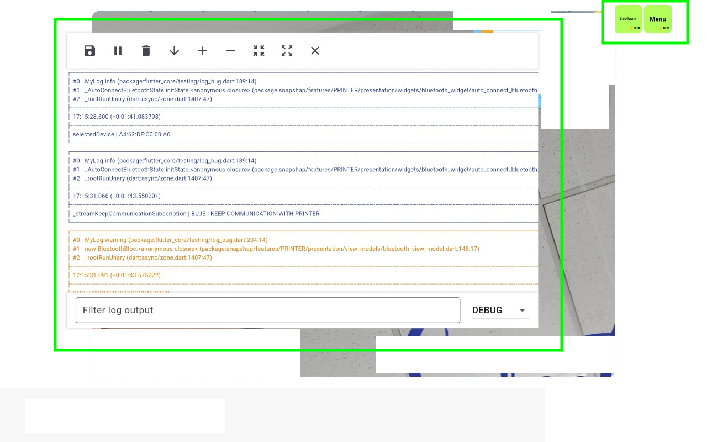

# Mẹo Để Code Nhanh Hơn Với Flutter

Trong lĩnh vực phát triển ứng dụng, việc tăng tốc quá trình code không chỉ giúp tiết kiệm thời gian mà còn nâng cao hiệu suất công việc và chất lượng sản phẩm. Việc code nhanh hơn không có nghĩa là sẽ làm giảm chất lượng code. Sau đây tôi sẽ trình bày các cách tôi sử dụng để giúp việc code các ứng dụng flutter lớn dễ dàng hơn mà còn có thể giúp việc bảo trì sửa lỗi trở nên dễ dàng và thuận tiện hơn.
Để xây dựng các dự án lớn, không thể tránh khỏi việc phải viết một lượng mã code khổng lồ. Thay vì cố gắng giảm thiểu khối lượng công việc một cách không thực tế, bạn nên tập trung vào việc làm sao để giảm thời gian code. 

## 1. Sử Dụng Mason

[Mason](https://pub.dev/packages/mason) là một công cụ mạnh mẽ giúp tự động hóa việc tạo mã nguồn. Nó cho phép bạn tạo ra các mẫu (templates) code có thể tái sử dụng, giúp giảm thời gian viết những đoạn code lặp đi lặp lại. Bằng cách thiết lập các brick (mẫu code), bạn có thể nhanh chóng tạo ra các thành phần như widget, màn hình, hoặc thậm chí là cấu trúc dự án hoàn chỉnh chỉ với vài lệnh đơn giản.
Mason không chỉ tạo ra code cho dart, bạn hoàn toàn có thể sử dụng nó với các ngôn ngữ khác. Hãy tham khảo bài viết của tôi về mason để hiểu cách hoạt động của nó và những ứng dụng của nó vào trong công việc của tôi. 
*LINK mason*

## 2. Thư Viện Sinh Code Từ Object

Các thư viện như [json_serializable](https://pub.dev/packages/json_serializable) và [build_runner](https://pub.dev/packages/build_runner) cho phép bạn tự động sinh code từ các đối tượng (object), đặc biệt hữu ích khi làm việc với JSON. Thay vì phải viết thủ công các phương thức `toJson` và `fromJson`, bạn chỉ cần định nghĩa model của mình và để thư viện lo phần còn lại. Điều này không chỉ tiết kiệm thời gian mà còn giảm thiểu lỗi do con người gây ra.
Nếu bạn biết cách kết hợp nó với mason bạn có thể tạo ra các object có đầy đủ chức năng mà bạn cần dùng như copyWith, hay so sáng. Bạn có thể tham khảo 2 mẫu code của tôi tại https://brickhub.dev/bricks/dr_entity và https://brickhub.dev/bricks/dr_freezed 

## 3. Thư Viện Sinh Code Cho Assets - `flutter_gen_runner`

[flutter_gen_runner](https://pub.dev/packages/flutter_gen_runner) giúp tự động tạo code cho các tài nguyên như hình ảnh, font chữ, và chuỗi ký tự. Thay vì phải nhớ và gõ chính xác đường dẫn đến từng tài nguyên, bạn có thể truy cập chúng một cách an toàn và nhanh chóng thông qua các biến đã được sinh sẵn. Điều này giúp giảm thiểu lỗi và tăng tốc quá trình code. Bạn có thể tìm hiểu nhiều hơn trong bài viết về các tạo 1 package giao diện tại đây
*LINK core ui*

## 4. Sử Dụng Shortcuts và Live Templates
### 4.1. Sử Dụng Shortcuts
Dưới đây là các phím tắt tôi hay sử dụng nhất trên Android studio, sử dụng các phím tắt này kiến tôi cảm thấy việc lập trình trở nên dễ dàng 1 phần nào đó. 
### 1.1.1 Genera
| Window              | Macos                 | Describe                                                                                                                                                                                                        |
|---------------------|-----------------------|-----------------------------------------------------------------------------------------------------------------------------------------------------------------------------------------------------------------|
| Shift+F10           | Control+R             | Run                                                                                                                                                                                                             |
| Shift+F9            | Control+D             | Debug                                                                                                                                                                                                           |
| Control+Space       | **Control+Space**     | Displays basic suggestions for variables, types, methods, expressions, and so on. If you call basic completion twice in a row, you see more results, including private members and non-imported static members. |
| Control+Tab         | Control+Tab           | Switch between tabs and tool window                                                                                                                                                                             |
| Press Shift twice   | **Press Shift twice** | Search everything (including code and menus)                                                                                                                                                                    |
| Control+F           | Command+F             | Find                                                                                                                                                                                                            |
| F3                  | Command+G             | Find next                                                                                                                                                                                                       |
| Shift+F3            | Command+Shift+G       | Find previous                                                                                                                                                                                                   |
| Control+R           | Command+R             | Replace                                                                                                                                                                                                         |
| Control+Shift+F     | Command+Shift+F       | Find in path                                                                                                                                                                                                    |
| Control+F12         | Command+F12           | Open file structure dialog                                                                                                                                                                                      |
| Shift+F4            | Shift+F4              | Open current editor tab in new window                                                                                                                                                                           |
| Control+E           | Command+E             | Recently opened files dialog                                                                                                                                                                                    |
| Control+Shift+E     | **Command+Shift+E**   | Recently edited files dialog                                                                                                                                                                                    |
| Control+G           | Command+L             | Go to line                                                                                                                                                                                                      |

### 1.1.2 WRITE CODE
| Window              | Macos                     | Describe                                                                                                                                                                                                        |
|---------------------|---------------------------|-----------------------------------------------------------------------------------------------------------------------------------------------------------------------------------------------------------------|
| Alt+Insert          | Command+N                 | Generate code (getters, setters, constructors,hashCode/equals,toString, new file, new class)                                                                                                                    |
| Control+O           | Control+O                 | Override methods                                                                                                                                                                                                |
| Control+I           | Control+I                 | Implement methods                                                                                                                                                                                               |
| Control+Alt+T       | **Command+Option+T**      | Surround with (if...else,try...catch, etc.)                                                                                                                                                                     |
| Control+Y           | Command+Delete            | Delete line at caret                                                                                                                                                                                            |
| Control+D           | Command+D                 | Duplicate current line or selection                                                                                                                                                                             |
| Control+Space       | Control+Space             | Basic code completion                                                                                                                                                                                           |
| Control+Shift+Space | Control+Shift+Space       | Smart code completion (filters the list of methods and variables by expected type)                                                                                                                              |
| Control+Q           | Control+J                 | Quick documentation lookup                                                                                                                                                                                      |
| F11                 | F3                        | Toggle bookmark                                                                                                                                                                                                 |
| Control+F11         | Option+F3                 | Toggle bookmark with mnemonic                                                                                                                                                                                   |
| Control+/           | Command+/                 | Comment/uncomment with line comment                                                                                                                                                                             |
| Control+Shift+/     | Command+Shift+/           | Comment/uncomment with block comment                                                                                                                                                                            |
| Control+W           | Option+Up -> **Option+W** | Select successively increasing code blocks                                                                                                                                                                      |
| Control+Shift+W     | Option+Down               | Decrease current selection to previous state                                                                                                                                                                    |
| Control+Alt+L       | Command+Option+L          | Reformat code                                                                                                                                                                                                   |
| Control+Alt+I       | Control+Option+I          | Auto-indent lines                                                                                                                                                                                               |
| Control+Shift+J     | Control+Shift+J           | Smart line join                                                                                                                                                                                                 |
| Control+Enter       | Command+Enter             | Smart line split                                                                                                                                                                                                |
| Shift+Enter         | Shift+Enter               | Start new line                                                                                                                                                                                                  |
| F2 or Shift+F2      | **F2 or Shift+F2**        | Next/previous highlighted error                                                                                                                                                                                 |

### 1.1.3 DEBUG
| Window              | Macos                | Describe                                                                                                                                                                                                        |
|---------------------|----------------------|-----------------------------------------------------------------------------------------------------------------------------------------------------------------------------------------------------------------|
| Shift+F9            | Control+D            | Debug                                                                                                                                                                                                           |
| F8                  | F8                   | Step over                                                                                                                                                                                                       |

### 1.1.4 REFACTER
| Window              | Macos                | Describe                                                                                                                                                                                                        |
|---------------------|----------------------|-----------------------------------------------------------------------------------------------------------------------------------------------------------------------------------------------------------------|
| Shift+F6            | Shift+F6             | Rename                                                                                                                                                                                                          |
| Control+Alt+V       | **Command+Option+V** | Extract variable                                                                                                                                                                                                |

### 1.1.5 GIT
| Window              | Macos                | Describe                                                                                                                                                                                                        |
|---------------------|----------------------|-----------------------------------------------------------------------------------------------------------------------------------------------------------------------------------------------------------------|
| Alt+\` (backtick)   | Control+V            | Open VCS dialog                                                                                                                                                                                                 |

Sử dụng các phím tắt này sẽ giúp bạn giảm thiểu thời gian gõ và tập trung hơn vào logic code của ứng dụng.
Bạn có thể tìm hiểu nhiều hơn tại [Learn more](https://developer.android.com/studio/intro/keyboard-shortcuts)

### 4.2. Sử Dụng Live Templates
Bạn có thể quen thuộc với stfull hay stless trong flutter để tạo ra StateFull và StateLess. Bạn cũng có thể tạo cho mình 1 mẫu code như thế bằng cách tạo live templates trong IDE Android Studio của mình. 
Hãy truy cập vào File > Settings > Editor > Live Templates trên Android studio để thử tạo 1 cái cho bản thân. 

## 5. Ứng Dụng AI 
AI đã trở nên vô cùng hữu dụng với các lập trình viên, nó giảm tải khối lượng công việc đáng kể cho lập trình viên, tôi có thể liệt kê các ứng dụng của chúng vào trong công việc hằng ngày của tôi. 
+ Ứng dụng vào việc chuyển đổi ngôn ngữ, hãy tham khảo bài viết về sử dụng nhiều ngôn ngữ của tôi tại đây. *LINK muilt-lang* 
+ Tạo các hàm cơ bản sử dụng các thuật toán. 
+ Tối ưu các hàm code với thuật toán tốt hơn. 
+ Tạo các hàm tạo code tự động.

Tôi đã tạo website https://wongcoupon.com/en/doc/help/flutter dựa vào AI, tôi đã nhờ nó viết các hàm lấy dữ liệu từ firebase 1 cách nhanh chóng và hiệu quả, giảm 1 lượng lớn thời gian tìm hiểu. Nó đã giúp tôi giảm 1 lượng lớn thời gian ngồi tìm hiểu và cài đặt.

## 6. Tạo Các Nút Ấn Để Code nhanh hơn

Trong quá trình phát triển, có những tính năng mất nhiều thời gian để hoàn thành hoặc thử nghiệm. Bằng cách tạo các nút hoặc lối tắt để bỏ qua hoặc giả lập kết quả của những tính năng này, bạn có thể dễ dàng kiểm tra phần còn lại của ứng dụng mà không bị gián đoạn.
Trước đây tôi đã phát triển 1 ứng dụng giao tiếp qua bluetooth, việc chờ đợi kết quả trả về gây mất thời gian. Tôi đã tạo các nút ấn ở trong môi trường develop để giả định đã nhận được kết quả trả về từ thiết bị qua bluetooth. Nó đã giúp tôi giảm khá nhiều thời gian trong việc phát triển ứng dụng. 
Nếu bạn muốn biết cách tạo ra các môi trường develop, staging, product thì hãy tham khảo bài viết này của tôi *LINK base project*

Có 1 ý tưởng tôi thấy là hữu ích đó là hiển thị log trên màn hình nhờ các nút test đó. Việc này hiệu quả khi thiết bị của bạn đang không debug, hay các lập tình viên backend có thể tự sử dụng app và check log mà không cần phải nhờ bạn debug để xem log, việc này sẽ giúp cho bạn giảm tải gánh nặng công việc của bản thân. Tuy nhiên nó sẽ hữu hiệu trên màn hình lớn như tablet. 
Nếu bạn muốn tạo các log có màu sắc như thế, hãy tham khảo bài viết này của tôi *LINK log*

Trên đây là những cách tôi code nhanh hơn, và khiến cho công việc code trở nên dễ dàng hơn. Nếu bạn có những cách nào tuyệt vời của cá nhân bạn, hãy chia sẻ và đóng góp với cộng đồng. 
