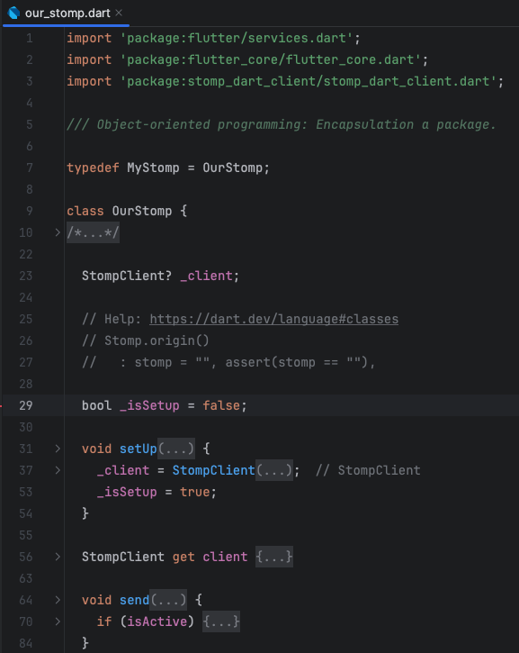
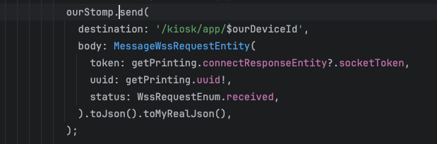

## Giảm Thời Gian Bảo Trì Và Duy Trì Code

Code nhanh hơn và dễ dàng hơn nhưng cũng vẫn phải đặt tiêu chí giảm thời gian bảo trì code nếu như gặp lỗi. Tôi sẽ trình bày cho bạn những cách tôi áp dụng vào project của bản thân mình.

### 1. Tư Duy Hướng Đối Tượng

Đây là cách cơ bản của tất cả các lập trình viên cần phải nắm vững ngay từ lúc ngồi trên giảng đường đại học. Tôi sẽ không trình bày lý thuyết của nó ở đây nữa. 

Mội trong những cách tôi áp dụng OOP vào trong các dự án là tác biệt hoàn toàn các thư viện bên thứ 3 và project. Đóng gói các phương thức phức tạp của thư viện bên thứ 3 vào trong các class và sử dụng nó. Việc làm như vậy sẽ giảm được độ phức tạp của thư viện, và cũng dễ dàng thay thế nếu thư viện đó trong tương lai bị ngừng hỗ trợ. 
Tôi sẽ ví dụ cho bạn 1 chút về cách tôi tích hợp 1 thư viện bên thứ 3 vào dự án: 

Tôi đang tích hợp thư viện stomp_dart_client vào trong dự án của mình. Tôi đã đưa tất cả những phần thức tạp của nó vào trong class OurStomp và sau đó chỉ việc sử dụng lại. 

Đây là cách tôi sử dụng lại nó, đơn giản hơn nhiều so với việc sử dụng trực tiếp thư viện và cũng dễ bảo trì hơn nhiều. Khi làm thế không những dễ bảo trì, dễ sử dụng, mà còn giúp bạn dễ dàng mang code của mình sang những dự án mới. 

### 2. Sử Dụng Kiến Trúc Clean Architecture

Clean Architecture giúp tách biệt rõ ràng giữa các tầng trong ứng dụng như Presentation, Domain, và Data. Điều này không chỉ làm cho code sạch sẽ hơn mà còn giúp dễ dàng thay đổi và mở rộng về sau. Bằng cách áp dụng kiến trúc này, bạn có thể:

- **Giảm thiểu sự phụ thuộc giữa các thành phần**, giúp việc bảo trì trở nên đơn giản hơn.
- **Dễ dàng kiểm thử từng phần**, nâng cao chất lượng ứng dụng.

Bạn có thể tham khảo bài viết chi tiết của tôi nó về Clean Architecture tại đây: 
*LINK clean architecture*

### 3. Tách Thành Các Package Dùng Chung

Việc tách các phần code thành các package riêng biệt giúp bạn:

- **Tái sử dụng code trong nhiều dự án khác nhau**.
- **Cập nhật và bảo trì dễ dàng**, khi chỉ cần thay đổi trong một package mà không ảnh hưởng đến toàn bộ dự án.

  Nếu bạn muốn lưu trữ những phần hay nhất của mình để sử dụng lại trong các dự án khác, hãy tham khảo ý tưởng của tôi tại đây.
  *LINK package*

### 4. Clean Code Và Format Code Nhanh

Sử dụng các công cụ format code tự động như [dartfmt](https://dart.dev/tools/dartfmt) hoặc tích hợp sẵn trong IDE giúp code của bạn luôn sạch sẽ và tuân theo các tiêu chuẩn nhất định. Điều này không chỉ giúp bạn mà còn giúp đồng nghiệp dễ dàng đọc và hiểu code của bạn hơn.
Bạn có thể đọc bài viết về clean code của tôi tại đây để hiểu thêm chi tiết về ý tưởng của tôi. 
*LINK clean code* 

### 5. Sử Dụng Activity Diagram

Activity Diagram là một công cụ hữu ích giúp mô tả luồng hoạt động của ứng dụng. Nó đặc biệt hữu ích khi:

- **Có thành viên mới tham gia dự án**, giúp họ nhanh chóng hiểu được cấu trúc và luồng xử lý.
- **Bảo trì code sau một thời gian dài**, khi bạn cần nhớ lại cách hoạt động của một phần cụ thể trong ứng dụng.
- **Sửa lỗi (debugging)**, khi bạn cần xác định chính xác điểm xảy ra vấn đề trong luồng xử lý.

Bạn có thể kham khảo ý tưởng của tôi về việc sử dụng Activity Diagram trong bài viết sau:

*LINK activity diagram* 

