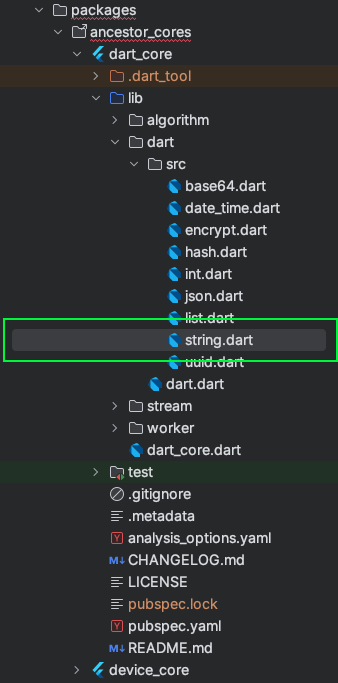

# Package, lưu trữ những gì hay nhất của bạn cho các dự án. 

**Tạo và quản lý package giúp giảm thời gian code đáng kể, tái sử dụng mã nguồn, và giúp duy trì dự án một cách dễ dàng hơn. Dưới đây là một số lợi ích cụ thể của việc tạo package:**

1. **Tái sử dụng mã nguồn**: Khi bạn tạo ra các package cho các tính năng hoặc thành phần phổ biến, bạn có thể tái sử dụng chúng trong nhiều dự án khác nhau mà không cần phải viết lại mã. Điều này giúp tiết kiệm thời gian và công sức.

2. **Dễ dàng quản lý và bảo trì**: Các package được tổ chức gọn gàng, dễ dàng cập nhật và bảo trì. Khi cần thay đổi hoặc nâng cấp một tính năng, bạn chỉ cần cập nhật package mà không ảnh hưởng đến toàn bộ dự án.

3. **Tăng cường tính nhất quán**: Sử dụng các package giúp đảm bảo rằng các đoạn mã nguồn của bạn luôn nhất quán và tuân thủ cùng một quy tắc hoặc chuẩn mực.

4. **Phát triển nhanh chóng**: Với các package được chuẩn bị sẵn, bạn có thể tập trung vào việc phát triển các tính năng đặc thù của dự án mà không mất thời gian cho các phần cơ bản.

5. **Chia sẻ và cộng tác**: Các package có thể được chia sẻ với cộng đồng hoặc nhóm làm việc, giúp tăng cường khả năng cộng tác và tận dụng kiến thức của nhau.

6. **Giảm thiểu lỗi**: Khi sử dụng lại các package đã được kiểm thử và ổn định, bạn sẽ giảm thiểu nguy cơ gặp phải các lỗi mới khi phát triển ứng dụng.

Dưới đây là hướng dẫn chi tiết về cách tạo và quản lý package:

## 1 Cách tôi thiết lập các package có thể sử dụng được trong nhiều dự án.


Tôi đã tạo 1 thư mục có tên là packages để lưu tất cả các package tôi tạo ra.
Tôi chia chúng thành 2 loại, 1 loại thuộc vào ancestor_core, đây là những package nền tảng mà tôi đã viết gọn lại các hàm theo phong cách của lập trình hướng đối tượng. Khi sử dụng chỉ việc gọi nó ra ngoài và sử dụng, không cần bận tâm đến cấu trúc phức tạp bên trong các hàm xử lý và thiết lập. 
Một loại khác là các package ui, nơi chứa đựng tất cả các widget ui của giao diện, hay những thứ gì liên quán đến ui, nó giúp tối giản 1 khối lượng code lớn và có thể tái sử dụng cho các dự án sau này. 

Hãy cùng đi sâu vào 1 trong số đó, fỉre_core:


Nơi đây tôi lưu trữ tất cả các phần code tôi đã từng code liên quan đến firebase. Nếu như trong tương lai, có 1 dự án nào mới cần sử dụng đến firebase, tôi chỉ việc import package này của tôi vào và sử dụng lại code tôi đã từng code trước đây. Thậm trí bạn có thể đồng bộ tất cả các package của các project khác nhau bằng git để cập nhập những code mới nhất cho dự án. 


## 2 Thiết lâp 1 Package

### Bước 1: Chạy
```bash
cd pathTo/packages

flutter create --template=package hello_core
```

### Bước 2: Thiết lập lint trong tệp pubspec.yaml

```bash
cd pathTo/hello_core
flutter pub add lint
flutter pub add test
flutter pub add mockito
```
The lint package is a package that helps check errors for Dart. This will help keep Dart code neat and formatted.
[Learn more](https://pub.dev/packages/lint)

### Bước 3: Thay thế tệp analysis_options.yaml
Thay thế tệp analysis_options.yaml của dự án
Thêm cấu hình phân tích lỗi từ gói `lint`.

```yaml
# File này cấu hình phân tích lỗi sử dụng bộ quy tắc từ package:lint

include: package:lint/strict.yaml # Dành cho các ứng dụng sản xuất
# include: package:lint/casual.yaml # Dành cho mã mẫu, hackathons và các mã không phải sản xuất
# include: package:lint/package.yaml # Dành cho các gói với API công khai

# Bạn có thể muốn loại bỏ các tệp tự động tạo ra khỏi phân tích dart
analyzer:
  errors:
    invalid_annotation_target: ignore
  plugins:
    - custom_lint
  exclude:
    - packages/mason_core/**
    - '**.freezed.dart'
    - '**.g.dart'

# Bạn có thể tùy chỉnh các quy tắc lint theo ý thích của mình. Một danh sách tất cả các quy tắc
# có thể được tìm thấy tại https://dart-lang.github.io/linter/lints/options/options.html
linter:
  rules:
    - unawaited_futures
rules:
  # Các lớp tiện ích rất tuyệt!
  # avoid_classes_with_only_static_members: false

  # Đặt các constructor lên đầu tiên trong mỗi lớp
  # sort_constructors_first: true

  # Lựa chọn khôn ngoan, nhưng không cần thiết
  prefer_double_quotes: true
  prefer_single_quotes: true
  avoid_dynamic_calls: true
  lines_longer_than_80_chars: true
  avoid_classes_with_only_static_members: true
  use_named_constants: true
```

Thay thế tệp analysis_options.yaml của package 
```yaml
include: ../../analysis_options.yaml
```

[Learn more](https://docs.flutter.dev/packages-and-plugins/developing-packages)

Để tạo cấu trúc các file thử mục như trong hình ảnh, bạn có thể sử dụng mason để tạo nó 1 cách nhanh chóng, nếu bạn chưa biết về mason. Bạn có thể tham khảo brick của tôi tại đây [dr_folder_package](https://brickhub.dev/search?q=dr_folder_package) 

## 3 Đồng bộ folder package ở các dự án khác nhau
Ý tưởng của tôi là sẽ đồng bộ tất cả chúng bằng git, và mỗi 1 package trong 1 dựa án sẽ được chứa trong 1 branch khác nhau, bạn có thể gộp tất cả chúng lại làm 1 sau này. 

### 3.1 Thiết lập vào trong dự án
Ý tưởng là tạo 1 project packages trên git và gán nó vào thư mực package của chúng ta. 
```bash
git clone https://gitlab.com/yourdoamin/packages.git
cd pathTo/packages
git checkout master
git branch feature-snap
git checkout feature-snap

```
Hoặc nếu thư mục đã tồn tại. 
```bash
cd pathTo/packages
git init
git remote add origin https://gitlab.com/yourdoamin/packages.git
git fetch 
```

Bạn sẽ thấy việc này khá là rườm rà, tại sao lại không tạo thành riêng 1 project package và nó tách riêng khỏi project chính. Việc làm của tôi có 1 ưu điểm là khi lập trình, chúng ta có thể dễ dàng thêm mới chỉnh sửa, tìm kiếm trong package, và toàn bộ code trong package vẫn nằm trong project, điều này sẽ đảm bảo an toàn nếu ai đó khoá packages của bạn trên git. 

### 3.2 Sử dụng 
#### Bước 1: Chạy
```bash
cd pathTo/packages
git add .
git commit -am "changed"
git push origin feature-snap
```
#### Bước 2: (tuỳ chọn) đẩy lên
```bash
cd pathTo/packages
git fetch
git pull origin master --rebase
```

## 4. Cách sử dụng chúng trong dự án thực tế
Giả sử tôi có 1 hàm để in json ra màn hình log theo đúng các json hiển thị, tôi sẽ cho nó vào trong 1 class có tên là string.dart được đặt trong package có tên là dart_core như hình dưới đây:


Bước 1: Bên trong file đó tôi sẽ có nội dung như sau: 
```dart
extension MyStringHelper on String {
  String get myPrintStringJson {
    if (isJSON(this)) {
      const JsonDecoder decoder = JsonDecoder();
      const JsonEncoder encoder = JsonEncoder.withIndent('  ');

      final object = decoder.convert(this);
      final prettyString = encoder.convert(object);
      var string = "";
      prettyString.split('\n').forEach((element) => string = '$string\n$element');
      return string;
    } else {
      var format = this;
      format = format.replaceAll('{', '\n{\n  ');
      format = format.replaceAll(',"', ',\n  "');
      format = format.replaceAll('}', '\n}');
      format = format.replaceAll('":', '" : ');
      format = format.replaceAll('[', '[\n  ');
      format = format.replaceAll(']', '\n]');
      return format;
    }
    // return this;
  }
}
```
Bước 2: Khai báo 
Tôi sẽ khai báo nó ra file dart_core.dart (Đây thực chất không phải là cách tôi làm trong package)
```dart
export 'dart/src/string.dart';
```

Bước 2: khai báo nó vào trong project 

```yaml
dependencies:
    flutter:
      sdk: flutter
    
    dart_core:
      path: packages/ancestor_cores/dart_core
```

Bước 3: Sử dụng 
Gải sử tôi đang muốn in ra 1 json ra ngoài màn hình.
```dart
import 'package:dart_core/dart_core.dart';


myLog.warning((await myLocation.locationAccuracy).toString().myPrintStringJson);
```

Như vậy là đã hoàn thành 1 chu trình tạo và sử dụng 1 hàm trong package, giờ bạn có thể tuỳ ý sáng tạo và lưu trữ những thứ hay nhất của mình trong package và tái sử dụng lại khi cần thiết. Cách này sẽ rất hữu ích khi thiết lập 1 dự án với Firebase, bạn có thể tái sử dụng lại ở nhiều dự án khác mà không mất thời gian thiết lập lại. 

