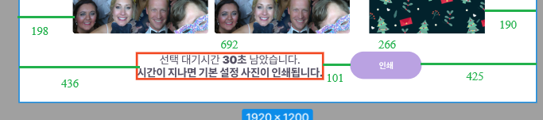
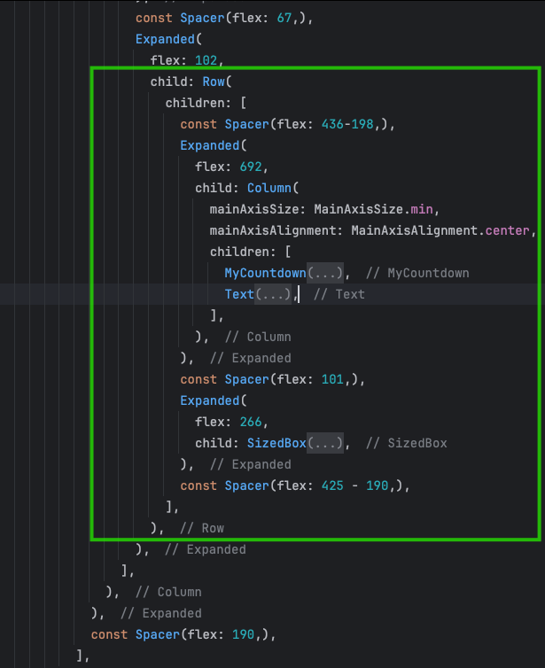

# Hướng dẫn Responsive Screen trong Flutter
Responsive design là một phần quan trọng khi phát triển ứng dụng Flutter để đảm bảo ứng dụng có giao diện đẹp trên nhiều kích thước màn hình khác nhau. Bài viết này sẽ hướng dẫn bạn cách làm responsive theo các phương pháp khác nhau trong Flutter.

## 1. Cách co giãn màn hình với `responsive_builder` và mason theo từng loại màn hình
- add ```responsive_builder: ^lastest_version``` in your `pubspec.yaml`

Thư viện responsive_builder giúp phân chia giao diện theo từng loại màn hình như mobile, tablet, desktop. Chúng ta có thể sử dụng ScreenTypeLayout.builder và OrientationLayoutBuilder để xử lý giao diện theo từng loại màn hình và hướng màn hình.
Đưới đây là cách tôi xây dựng màn hình có thể tuỳ biến với các thiết bị chính như tablet và mobile. 
Ý tưởng của tôi là tôi sẽ xây các mảnh nhỏ của giao diện, sau đó ghép chúng vào tuỳ theo loại màn hình cần hiển thị, ở đây chúng ta có 4 loại: chiều ngang, dọc của mobile và chiều ngang, dọc của tablet

Đơn giản ở đây tôi sẽ chỉ có 1 phần giao diện cần hiển thị chung cho tất cả gọi là body. Sau đó tôi sắp sếp nó vào 4 loại màn hình khác nhau bên trên. 
```dart
import 'package:flutter/material.dart';
import 'package:responsive_builder/responsive_builder.dart';

part 'responsive_screen_mobile.dart';
part 'responsive_screen_tablet.dart';
part 'part_screen/responsive_screen_body.dart';

class ResponsiveScreen extends StatelessWidget {
  const ResponsiveScreen({super.key});

  @override
  Widget build(BuildContext context) {
    final body = const ResponsiveScreenBody();
    return ScreenTypeLayout.builder(
      mobile: (_) => OrientationLayoutBuilder(
        portrait: (context) => ResponsiveScreenMobilePortrait(body: body),
        landscape: (context) => ResponsiveScreenMobileLandscape(body: body),
      ),
      tablet: (_) => OrientationLayoutBuilder(
        portrait: (context) => ResponsiveScreenTabletPortrait(body: body),
        landscape: (context) => ResponsiveScreenTabletLandscape(body: body),
      ),
    );
  }
}
```
### Mobile Layouts

Đây là những gì sẽ xuất hiện bên trong màn hình mobile, bạn có thể tuỳ ý sắp sếp theo giao diện mà bạn đã thiết kế trước.

```dart
part of 'responsive_screen.dart';

class ResponsiveScreenMobilePortrait extends StatelessWidget {
  const ResponsiveScreenMobilePortrait({super.key, required this.body});
  final Widget body;

  @override
  Widget build(BuildContext context) {
    return Padding(
      padding: const EdgeInsets.symmetric(horizontal: 20),
      child: body,
    );
  }
}

class ResponsiveScreenMobileLandscape extends StatelessWidget {
  const ResponsiveScreenMobileLandscape({super.key, required this.body});
  final Widget body;

  @override
  Widget build(BuildContext context) {
    return Row(
      children: [
        const Spacer(flex: 130,),
        Expanded(
          flex: 1180,
          child: body,),
        const Spacer(flex: 130,),
      ],
    );
  }
}
```
### Tablet Layouts

Đây là những gì sẽ xuất hiện bên trong màn hình tablet, bạn có thể tuỳ ý sắp sếp theo giao diện mà bạn đã thiết kế trước.


```dart
part of 'responsive_screen.dart';

class ResponsiveScreenTabletPortrait extends StatelessWidget {
  const ResponsiveScreenTabletPortrait({super.key, required this.body});
  final Widget body;

  @override
  Widget build(BuildContext context) {
    return Row(
      children: [
        const Spacer(flex: 130),
        Expanded(flex: 1180, child: body),
        const Spacer(flex: 130),
      ],
    );
  }
}

class ResponsiveScreenTabletLandscape extends StatelessWidget {
  const ResponsiveScreenTabletLandscape({super.key, required this.body});
  final Widget body;

  @override
  Widget build(BuildContext context) {
    return Row(
      children: [
        const Spacer(flex: 130),
        Expanded(flex: 1180, child: body),
        const Spacer(flex: 130),
      ],
    );
  }
}
```

Chắc chắn rằng màn hình mobile và table thì chúng sẽ có thứ tự sắp sếp khác nhau để tăng trải nghiệm của người dùng. 
Nhưng có 1 vấn đề đặt ra ở đây là bạn sẽ phải viết đi viết lại đoạn mã trên mỗi khi có 1 màn hình mới tạo ra, tôi đã sử dụng mason để giảm tải công việc cho bản thân mình. 
Bạn có thể tham khảo brick dr_responsive của tôi tại đây. https://brickhub.dev/bricks/dr_responsive. 
Nếu bạn chưa biết gì về mason, hay tham khảo bài viết này của tôi về mason *LINK MASON*, tôi chắc chắn nó sẽ tiết kiệm vô cùng nhiều thời gian của bạn.  

## 2. Responsive theo tỷ lệ màn hình
Trong thực tế, các kích thước màn hình điện thoại không hề giống nhau tuỳ cùng 1 tỷ lệ, Sử dụng `MediaQuery` để xác định tỷ lệ màn hình và điều chỉnh UI phù hợp.

Ý tưởng của tôi là sử dụng tỷ lệ này cùng với tỷ lệ trong figma để đảm bảo UI không bị tràn hay vỡ và luôn giữ được tỷ lệ của nó trên cách thiết bị. 
```dart
class ResponsiveWidget extends StatelessWidget {
  @override
  Widget build(BuildContext context) {
    double screenWidth = MediaQuery.of(context).size.width;
    double screenHeight = MediaQuery.of(context).size.height;

    return Container(
      width: screenWidth * 800, // Chiếm 80% chiều rộng màn hình
      height: screenHeight * 200, // Chiếm 50% chiều cao màn hình
      color: Colors.blue,
      child: const Center(child: Text("Responsive Container")),
    );
  }
}
```
Bạn có thể thấy việc viết MediaQuery.of(context).size.width khá là dài và mất thời gian, tôi sẽ chia sẻ cho bạn cách của tôi:  

ý tưởng của tôi là sẽ tạo ra 1 biến có thể dùng chung cho cả dự án, giả sử ở đây tôi chọn tỷ lệ theo kích thước là lấy chiều dài của thiết bị chia cho chiều dài được thiết kế trong figma để thương thích với các thiết bị theo chiều ngang. 
Tỷ lệ này có độ lớn tối đa là 1 và nhỏ nhất là 0.2 so với kích thước được thiết kế trong figma. 
```dart
extension MyBuildContext on BuildContext {
  
  double get myHeight => MediaQuery.of(this).size.height;
  double get myWidth => MediaQuery.of(this).size.width;
  /// Edit ratio of fontSize for responsive screen
  double get dsgRatio {
    final ratio = myWidth / 1920;
    return ratio < 1
        ? ratio < 0.2
            ? 0.2
            : ratio
        : 1;
  }
}
```
Sau đó sẽ gọi nó như sau, giả sử ở đây tôi có tỷ lệ sizedBox trong figma là 260 px.  
```dart
class ButtonAddCouponPartScreen extends StatelessWidget {
  const ButtonAddCouponPartScreen({
    super.key,
  });

  @override
  Widget build(BuildContext context) {
    final ratio = context.dsgRatio;
    return SizedBox(
      width: 260 * ratio,
    );
  }
}
```
Cách này tôi thường sử dụng cho các widget khi chúng cần width hoặc height để hiển thị. 
Nếu bạn muốn biết thêm về cách responsive cỡ chữ, hãy tham khảo bài viết về theme của tôi *LINK* 

## 3. Sử dụng `Expanded` và `Spacer`

Nếu bạn thấy cách trên tốn tài nguyên khi phải tìm xem chiều rộng của thiết bị, tính tỉ lệ sau đó mới ra được kích thước thật của widget thì tôi có 1 cách khác dành cho bạn:
Sử dụng: `Expanded` và `Spacer`

For example, the image below has the following design and size:



Bây giờ tôi sẽ sử dụng `Expanded` và `Spacer` để tạo giao diện, và kết quả sẽ tương tự như việc chia tỷ lệ bên trên.



Chúng ta có thể thấy được ưu điểm rõ ràng khi không phải tính toán tỷ lệ nào khi tạo ra giao diện mà vẫn cho ra kết quả responsive như ý. 
Cách này tôi thường sử dụng khi xây dựng giao diện cho các màn hình. 


# Conclusion

Trên đây tôi đã trình bày 3 cách để reponsive 1 giao diện flutter. Trong thực tế tôi sử dụng cả 3 cách trên. Mỗi cách có 1 ưu và nhược điểm riêng, hãy tận dụng những kiến thức của tôi để giúp ứng dụng của bạn hoạt động hiệu quả hơn. 
